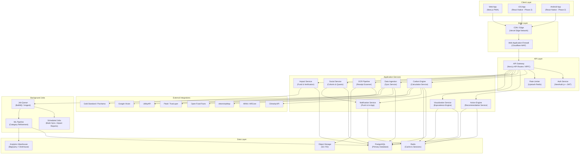
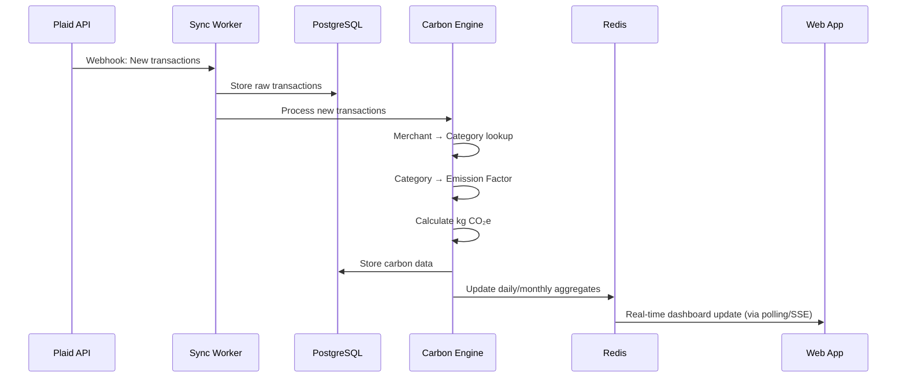
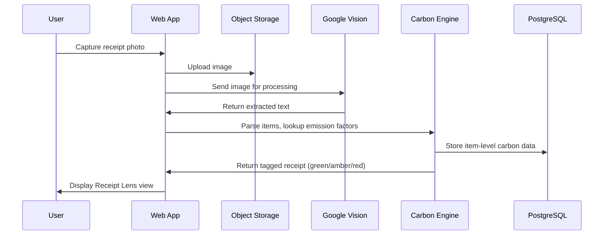
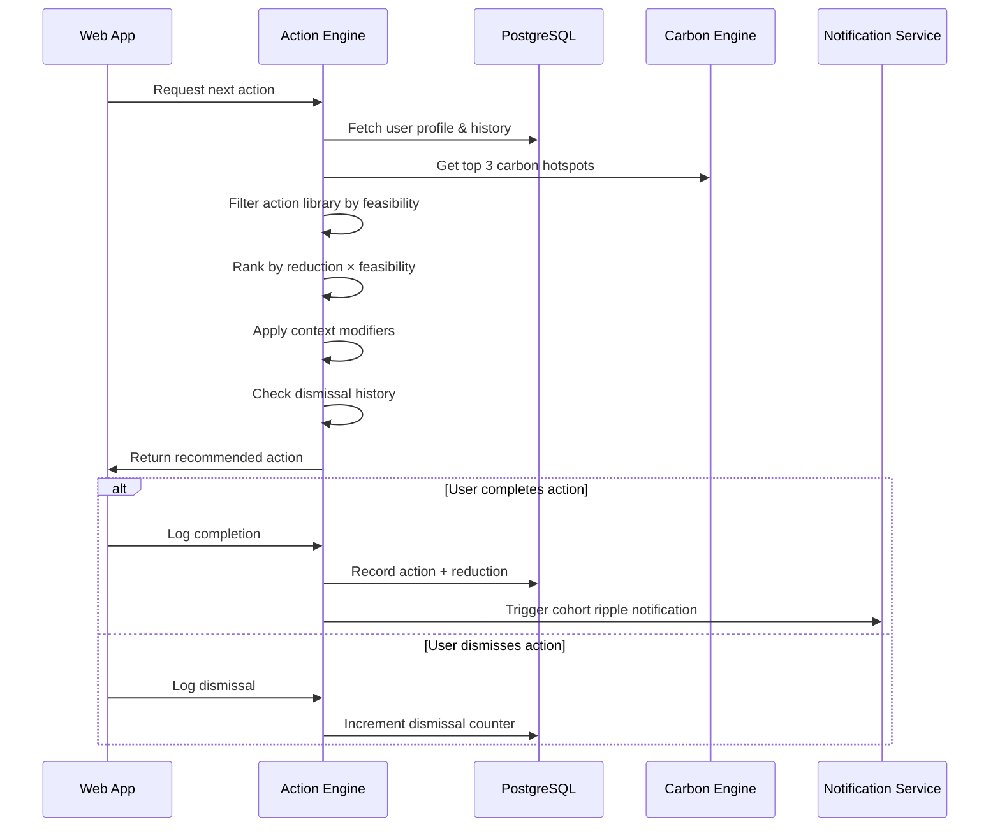
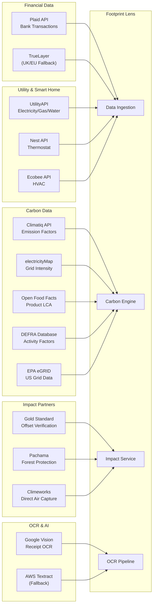
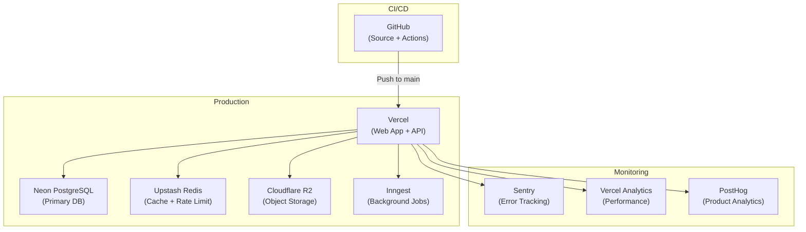

# System Architecture Document

**Project:** Footprint Lens
**Version:** 1.0
**Date:** June 2026
**Status:** Draft

---

## 1. Overview

Footprint Lens is a personal carbon intelligence platform that ingests financial, utility, and lifestyle data, calculates carbon emissions, provides personalized coaching, and delivers verified impact reporting. The architecture prioritizes **real-time responsiveness**, **data security**, **horizontal scalability**, and **progressive enhancement** (web-first, native-ready).

---

## 2. High-Level Architecture



---

## 3. Component Breakdown

### 3.1 Client Layer

| Component | Technology | Responsibility |
|:---|:---|:---|
| **Web App** | Next.js 14+ (App Router), React 18+, TypeScript | Primary user interface; PWA-capable; responsive (mobile-first) |
| **Native Apps** (Phase 2) | React Native + Expo | iOS/Android apps with native AR, push notifications, and background location |

**Key Architectural Decisions:**
- **Web-first PWA** for rapid iteration and cross-platform reach in MVP
- **React Server Components (RSC)** for optimal initial load — server-rendered carbon data, client hydrated interactions
- **Streaming SSR** for progressive page loads

### 3.2 Edge Layer

| Component | Technology | Responsibility |
|:---|:---|:---|
| **CDN** | Vercel Edge Network | Static asset serving, edge caching, image optimization |
| **WAF** | Cloudflare WAF | DDoS protection, bot mitigation, IP-based rate limiting |

### 3.3 API Layer

| Component | Technology | Responsibility |
|:---|:---|:---|
| **API Gateway** | Next.js API Routes + tRPC | Type-safe API layer with automatic TypeScript inference |
| **Auth Service** | NextAuth.js v5 | OAuth 2.0 (Google, Apple), email/password, session management |
| **Rate Limiter** | Upstash Redis + middleware | Per-user and per-IP rate limiting on all endpoints |

**Key Architectural Decision — tRPC:**
We use tRPC instead of REST/GraphQL for the primary API because:
1. End-to-end type safety between client and server (zero code generation)
2. Smaller bundle size vs. GraphQL clients
3. Simpler mental model for a small team
4. REST endpoints are still exposed for mobile clients and third-party integrations

### 3.4 Application Services

#### 3.4.1 Carbon Engine

```
Responsibility: Core carbon calculation pipeline
Input: Raw transaction data, utility readings, profile data
Output: Per-transaction kg CO₂e values, category aggregations

Pipeline:
  Transaction → Merchant Lookup → Category Mapping → Emission Factor Selection → Calculation → Storage
```

- Maintains a local cache of emission factors (refreshed quarterly)
- Supports manual category corrections via user feedback loop
- Calculates daily, weekly, monthly, and yearly aggregates

#### 3.4.2 Action Engine

```
Responsibility: Personalized action recommendation
Input: User profile, carbon hotspots, action history, context signals
Output: Single recommended action with carbon reduction estimate

Algorithm:
  1. Identify top 3 carbon hotspots from user data
  2. Filter action library by feasibility (user profile match)
  3. Rank by (Reduction Potential × Feasibility Score)
  4. Apply context modifiers (time of day, day of week, recent activity)
  5. Check dismissal history (retire after 3 dismissals)
  6. Deliver top-ranked action
```

#### 3.4.3 Data Ingestion Service

```
Responsibility: Orchestrate all data source connections
Components:
  - Bank Sync Worker (Plaid webhooks + scheduled polling)
  - Utility Sync Worker (UtilityAPI periodic pulls)
  - Smart Home Sync Worker (device API event streams)
  - Location/Travel Detector (background geofencing — native only)
```

#### 3.4.4 OCR Pipeline

```
Responsibility: Receipt scanning and item extraction
Pipeline:
  Camera Capture → Image Upload (S3) → OCR (Google Vision) →
  Text Extraction → Item Parsing → Carbon Tagging (Climatiq + Open Food Facts) →
  Results to Client + Storage
```

- Processing target: ≤ 3 seconds end-to-end
- Falls back to manual item entry on OCR failure

#### 3.4.5 Visualization Service

```
Responsibility: Carbon-to-equivalence translations
Input: kg CO₂e values
Output: Physical metaphors (balloons, ice area, trees, shower hours, etc.)

Uses a configurable equivalence factor table:
  1 kg CO₂e = X party balloons
  1 kg CO₂e = Y sq ft Arctic ice
  1 kg CO₂e = Z tree-hours of absorption
```

#### 3.4.6 Social Service

```
Responsibility: Cohort management, quests, ripple notifications
Features:
  - Cohort CRUD (create, invite, join, leave)
  - Quest lifecycle (selection, progress tracking, completion)
  - Anonymous activity feed generation
  - Ripple notification dispatch
```

#### 3.4.7 Impact Service

```
Responsibility: Fund allocation, verification tracking, impact reporting
Features:
  - Aggregate verified reductions platform-wide
  - Track Impact Fund revenue allocation (10% of subscriptions)
  - Interface with Gold Standard / Pachama / Climeworks APIs
  - Generate monthly impact reports with verification certificates
  - Manage quarterly user voting on project categories
```

#### 3.4.8 Notification Service

```
Responsibility: All push, in-app, and email communications
Channels:
  - Push notifications (FCM / APNs)
  - In-app notification feed
  - Email digests (weekly summary, impact reports)
  - Ripple notifications (real-time via WebSocket)
```

### 3.5 Data Layer

| Component | Technology | Purpose |
|:---|:---|:---|
| **Primary Database** | PostgreSQL 16 (Neon / Supabase) | User data, transactions, actions, cohorts, quests |
| **Cache** | Redis (Upstash) | Session tokens, rate limit counters, frequently-read aggregates, real-time leaderboard data |
| **Object Storage** | Cloudflare R2 / AWS S3 | Receipt images, forest screenshots, AR assets |
| **Analytics Warehouse** | BigQuery or ClickHouse | Aggregate analytics, ML training data, impact reporting |

### 3.6 Background Job System

| Component | Technology | Purpose |
|:---|:---|:---|
| **Job Queue** | Inngest (or BullMQ) | Reliable async job processing with retry/backoff |
| **Scheduled Jobs** | Inngest Cron | Bank sync (daily), utility sync (monthly), impact reports (monthly), emission factor updates (quarterly) |
| **ML Pipeline** | Python (scikit-learn / lightweight) | Category mapping refinement based on user corrections |

---

## 4. Data Flow

### 4.1 Transaction Processing Flow



### 4.2 Receipt Scanning Flow



### 4.3 Action Recommendation Flow



---

## 5. Technology Stack

### 5.1 Complete Stack Overview

| Layer | Technology | Justification |
|:---|:---|:---|
| **Language** | TypeScript (full-stack) | Type safety, shared types client/server, single-language team |
| **Frontend Framework** | Next.js 14+ (App Router) | SSR/RSC for performance, file-based routing, API routes, Vercel deployment |
| **UI Library** | React 18+ | Component model, ecosystem, RSC support |
| **Styling** | Tailwind CSS + custom theme | Matches UI/UX doc specification; rapid prototyping with design token consistency |
| **Animation** | Framer Motion + Lottie | Declarative React animations; Lottie for complex illustrations (glacier, forest) |
| **State Management** | Zustand (client) + React Query / tRPC (server) | Minimal boilerplate; automatic cache invalidation |
| **API** | tRPC + Next.js API Routes | End-to-end type safety; REST fallback for mobile |
| **ORM** | Drizzle ORM | Type-safe SQL, lightweight, great DX with PostgreSQL |
| **Database** | PostgreSQL 16 (Neon serverless) | ACID compliance, JSONB for flexible schemas, PostGIS for location |
| **Cache** | Redis (Upstash serverless) | Session store, rate limiting, real-time aggregates |
| **Auth** | NextAuth.js v5 (Auth.js) | OAuth providers, JWT, session management |
| **Object Storage** | Cloudflare R2 | S3-compatible, zero egress fees |
| **Job Queue** | Inngest | Serverless-friendly, retry/backoff, cron scheduling |
| **Hosting** | Vercel (web) + Neon (database) | Serverless, auto-scaling, minimal DevOps |
| **Monitoring** | Sentry (errors) + Vercel Analytics (performance) | Real-time error tracking, Core Web Vitals |
| **Analytics** | PostHog (self-hosted or cloud) | Privacy-focused product analytics |
| **AR (Web)** | 8th Wall / Model Viewer | WebAR without native app requirement |
| **Icons** | Phosphor Icons (React) | Duotone style matching design system |
| **Fonts** | Fraunces, Inter, JetBrains Mono (Google Fonts) | As specified in UI/UX design system |
| **Accessibility** | Radix UI primitives | Accessible interactive components |
| **Testing** | Vitest + Playwright + Testing Library | Unit, integration, E2E |

### 5.2 Architecture Decision Records (ADRs)

#### ADR-001: Web-First PWA Over Native

**Decision:** Build a Next.js PWA for MVP; defer native apps to Phase 2.

**Context:** Limited team (2-4 engineers). Need cross-platform reach quickly.

**Rationale:**
- Single codebase for web, mobile-web, and installable PWA
- Faster iteration cycles (deploy in minutes vs. app store review)
- AR features can use WebAR (8th Wall) for MVP; full ARKit/ARCore in native Phase 2
- Background sync limited on web; acceptable for MVP (manual scan + bank webhooks cover 80% of use cases)

**Consequences:**
- Background location tracking not available until native app
- Push notifications limited to web push (no iOS web push until Phase 2)
- AR quality lower than native ARKit/ARCore

---

#### ADR-002: tRPC Over REST/GraphQL

**Decision:** Use tRPC as the primary API protocol.

**Context:** Small team, rapid iteration, full TypeScript stack.

**Rationale:**
- Zero code generation; types inferred automatically
- Smaller client bundle than Apollo/urql GraphQL clients
- Direct function calls with full type safety
- REST endpoints generated via Next.js API routes for external/mobile consumers

**Consequences:**
- tRPC is TypeScript-only; mobile clients (Phase 2) use REST adapter
- Less familiar to developers from REST/GraphQL backgrounds

---

#### ADR-003: PostgreSQL Over MongoDB

**Decision:** Use PostgreSQL as the primary database.

**Context:** Data has strong relational patterns (users → transactions → categories → emission factors).

**Rationale:**
- ACID transactions for financial data integrity
- JSONB columns for flexible/evolving schemas (action library, equivalence factors)
- PostGIS extension for location-based features (zip code cohorts, grid carbon intensity)
- Mature ecosystem, excellent Drizzle ORM support
- Neon provides serverless PostgreSQL (scales to zero, branches for dev/staging)

---

#### ADR-004: Serverless Architecture

**Decision:** Deploy on serverless infrastructure (Vercel + Neon + Upstash + Inngest).

**Context:** Startup with variable traffic patterns and limited DevOps capacity.

**Rationale:**
- Zero server management
- Pay-per-use pricing aligned with growth
- Auto-scaling handles traffic spikes (viral moments, press coverage)
- Neon database branching enables instant dev/staging environments

**Consequences:**
- Cold start latency on infrequently-accessed routes (~200ms)
- Maximum function execution time limits (Vercel: 60s default, configurable)
- WebSocket support requires separate service (Ably/Pusher for real-time features)

---

#### ADR-005: Event-Driven Architecture for Data Ingestion

**Decision:** Use event-driven patterns for all data ingestion workflows.

**Context:** Multiple async data sources (bank webhooks, utility pulls, receipt scans) with varying latency.

**Rationale:**
- Decouples data sources from processing pipeline
- Inngest provides reliable event processing with automatic retry
- Enables replay of failed events without data loss
- Natural fit for webhook-based integrations (Plaid, UtilityAPI)

---

## 6. Third-Party Integrations

### 6.1 Integration Architecture



### 6.2 Integration Risk Matrix

| Integration | Criticality | Fallback Strategy |
|:---|:---|:---|
| Plaid | Critical | TrueLayer (EU), manual transaction entry |
| Climatiq | Critical | Local emission factor cache (DEFRA/EPA static data) |
| Google Vision | High | AWS Textract fallback; manual item entry |
| electricityMap | Medium | EPA eGRID static data for US; DEFRA for UK |
| Open Food Facts | Medium | Generic category-level factors from Climatiq |
| UtilityAPI | Medium | Manual utility bill entry |
| Gold Standard / Pachama | Low (reporting) | Impact reports delayed; no user-facing degradation |

---

## 7. Deployment Architecture



---

## 8. Cross-Cutting Concerns

### 8.1 Observability

- **Structured logging:** JSON-formatted logs with correlation IDs across all services
- **Distributed tracing:** OpenTelemetry spans for request lifecycle tracking
- **Metrics:** Custom business metrics (calculations/sec, actions completed/day, cohort engagement)
- **Alerting:** PagerDuty/Slack alerts for error rate spikes, latency degradation, third-party API failures

### 8.2 Resilience Patterns

- **Circuit Breaker:** For all third-party API calls (Plaid, Climatiq, Google Vision)
- **Retry with Exponential Backoff:** For transient failures (max 3 retries, 1s/2s/4s)
- **Bulkhead Isolation:** Separate connection pools for critical vs. non-critical services
- **Graceful Degradation:** App functions with cached data when external services are unavailable

### 8.3 Multi-Tenancy & Isolation

- All data is user-scoped via `user_id` foreign keys
- Row-Level Security (RLS) on PostgreSQL for additional protection
- Cohort data is aggregated and anonymized before display

---

*Document maintained by the Engineering Team. Last updated: June 2026.*
