# Database Design Document

**Project:** Footprint Lens
**Version:** 1.0
**Date:** June 2026
**Status:** Draft
**Database:** PostgreSQL 16 (Neon Serverless)

---

## 1. Design Principles

1. **Relational integrity** — Strong foreign key relationships for data consistency
2. **Flexible schemas** — JSONB columns for evolving data structures (action metadata, emission factors)
3. **Temporal awareness** — All carbon data is time-series; every record has timestamps
4. **Privacy by design** — PII isolated in dedicated tables; easy to purge on account deletion
5. **Query optimization** — Indexes aligned with access patterns; read replicas for analytics

---

## 2. Entity Relationship Diagram

```mermaid
erDiagram
    USERS ||--o{ DATA_SOURCES : connects
    USERS ||--o{ TRANSACTIONS : has
    USERS ||--o{ CARBON_RECORDS : has
    USERS ||--o{ RECEIPT_SCANS : uploads
    USERS ||--o{ USER_ACTIONS : performs
    USERS ||--o{ COHORT_MEMBERS : "belongs to"
    USERS ||--|| USER_PROFILES : has
    USERS ||--|| USER_PREFERENCES : has
    USERS ||--o| SUBSCRIPTIONS : subscribes
    USERS ||--o{ NOTIFICATIONS : receives
    USERS ||--o{ FOREST_TREES : grows

    TRANSACTIONS ||--|| CARBON_RECORDS : "calculated from"
    RECEIPT_SCANS ||--o{ RECEIPT_ITEMS : contains
    RECEIPT_ITEMS ||--|| CARBON_RECORDS : "calculated from"

    COHORTS ||--o{ COHORT_MEMBERS : contains
    COHORTS ||--o{ QUESTS : has
    QUESTS ||--o{ QUEST_PROGRESS : tracks

    ACTIONS ||--o{ USER_ACTIONS : "instance of"
    ACTION_TIERS ||--o{ ACTIONS : categorizes

    EMISSION_FACTORS ||--o{ CARBON_RECORDS : "used in"
    MERCHANT_CATEGORIES ||--o{ TRANSACTIONS : "categorizes"

    IMPACT_REPORTS ||--o{ IMPACT_PROJECTS : funds
    IMPACT_VOTES ||--o{ USERS : "cast by"

    USERS {
        uuid id PK
        varchar email UK
        varchar password_hash
        varchar auth_provider
        varchar auth_provider_id
        boolean is_anonymous
        timestamp created_at
        timestamp updated_at
        timestamp deleted_at
    }

    USER_PROFILES {
        uuid id PK
        uuid user_id FK
        varchar home_type
        varchar primary_transport
        varchar diet_type
        varchar flight_frequency
        varchar shopping_habit
        integer accuracy_score
        decimal total_co2_reduced_kg
        integer forest_tree_count
        varchar region
        varchar timezone
        timestamp onboarding_completed_at
    }

    USER_PREFERENCES {
        uuid id PK
        uuid user_id FK
        varchar theme
        varchar notification_frequency
        boolean location_tracking_enabled
        boolean ar_enabled
        boolean pause_mode
        timestamp pause_until
        jsonb privacy_settings
    }

    DATA_SOURCES {
        uuid id PK
        uuid user_id FK
        varchar source_type
        varchar provider
        varchar provider_account_id
        varchar status
        jsonb credentials_ref
        timestamp last_sync_at
        timestamp created_at
    }

    TRANSACTIONS {
        uuid id PK
        uuid user_id FK
        uuid data_source_id FK
        varchar external_id UK
        varchar merchant_name
        varchar merchant_category
        uuid category_id FK
        decimal amount
        varchar currency
        date transaction_date
        boolean user_corrected
        jsonb raw_data
        timestamp created_at
    }

    CARBON_RECORDS {
        uuid id PK
        uuid user_id FK
        uuid transaction_id FK
        uuid receipt_item_id FK
        uuid emission_factor_id FK
        varchar source_type
        decimal co2e_kg
        varchar category
        varchar subcategory
        date record_date
        jsonb calculation_details
        timestamp created_at
    }

    RECEIPT_SCANS {
        uuid id PK
        uuid user_id FK
        varchar image_url
        varchar ocr_provider
        varchar status
        jsonb raw_ocr_result
        timestamp scanned_at
    }

    RECEIPT_ITEMS {
        uuid id PK
        uuid receipt_scan_id FK
        varchar item_name
        decimal quantity
        varchar unit
        decimal price
        varchar impact_level
        decimal co2e_kg
        varchar suggested_swap
        decimal swap_co2e_kg
        jsonb product_data
    }

    MERCHANT_CATEGORIES {
        uuid id PK
        varchar merchant_pattern
        varchar category
        varchar subcategory
        decimal default_emission_factor
        integer confidence_score
        timestamp updated_at
    }

    EMISSION_FACTORS {
        uuid id PK
        varchar source
        varchar category
        varchar subcategory
        varchar activity_unit
        decimal factor_kg_co2e
        varchar region
        date valid_from
        date valid_to
        jsonb metadata
    }

    ACTIONS {
        uuid id PK
        uuid tier_id FK
        varchar title
        text description
        text impact_description
        varchar category
        decimal estimated_co2e_reduction_kg
        integer feasibility_score
        jsonb context_rules
        jsonb profile_match_rules
        boolean is_active
        timestamp created_at
    }

    ACTION_TIERS {
        uuid id PK
        varchar name
        integer tier_level
        varchar icon
        varchar color
        integer unlock_threshold
        text description
    }

    USER_ACTIONS {
        uuid id PK
        uuid user_id FK
        uuid action_id FK
        varchar status
        integer dismissal_count
        decimal actual_co2e_saved_kg
        timestamp completed_at
        timestamp first_shown_at
        timestamp last_shown_at
    }

    COHORTS {
        uuid id PK
        varchar name
        varchar type
        varchar invite_code UK
        varchar region
        integer max_members
        timestamp created_at
    }

    COHORT_MEMBERS {
        uuid id PK
        uuid cohort_id FK
        uuid user_id FK
        varchar avatar_color
        varchar avatar_shape
        varchar role
        timestamp joined_at
        timestamp left_at
    }

    QUESTS {
        uuid id PK
        uuid cohort_id FK
        varchar quest_type
        varchar title
        text description
        decimal target_co2e_kg
        decimal current_co2e_kg
        varchar status
        date start_date
        date end_date
        jsonb metadata
    }

    QUEST_PROGRESS {
        uuid id PK
        uuid quest_id FK
        uuid user_id FK
        decimal contribution_co2e_kg
        varchar action_description
        timestamp recorded_at
    }

    FOREST_TREES {
        uuid id PK
        uuid user_id FK
        varchar tree_species
        varchar reduction_category
        decimal co2e_represented_kg
        integer position_x
        integer position_y
        boolean is_milestone
        varchar wildlife_unlocked
        timestamp planted_at
    }

    SUBSCRIPTIONS {
        uuid id PK
        uuid user_id FK
        varchar plan
        varchar status
        varchar payment_provider
        varchar external_subscription_id
        decimal price
        varchar currency
        timestamp current_period_start
        timestamp current_period_end
        timestamp cancelled_at
        timestamp created_at
    }

    NOTIFICATIONS {
        uuid id PK
        uuid user_id FK
        varchar type
        varchar channel
        varchar title
        text body
        jsonb data
        boolean is_read
        timestamp sent_at
        timestamp read_at
    }

    IMPACT_REPORTS {
        uuid id PK
        integer year
        integer month
        decimal total_co2e_reduced_kg
        decimal fund_amount_usd
        integer active_user_count
        jsonb project_allocations
        varchar status
        timestamp published_at
    }

    IMPACT_PROJECTS {
        uuid id PK
        uuid report_id FK
        varchar partner
        varchar project_name
        varchar certificate_id
        varchar verification_url
        decimal co2e_offset_kg
        decimal area_protected_acres
        varchar satellite_image_url
        jsonb metadata
    }

    IMPACT_VOTES {
        uuid id PK
        uuid user_id FK
        integer quarter
        integer year
        varchar category_voted
        timestamp voted_at
    }
```



---

## 3. Detailed Table Schemas

### 3.1 Core User Tables

#### `users`

```sql
CREATE TABLE users (
    id              UUID PRIMARY KEY DEFAULT gen_random_uuid(),
    email           VARCHAR(320) UNIQUE,
    password_hash   VARCHAR(255),
    auth_provider   VARCHAR(50),     -- 'google', 'apple', 'email', 'anonymous'
    auth_provider_id VARCHAR(255),
    is_anonymous    BOOLEAN DEFAULT TRUE,
    created_at      TIMESTAMPTZ DEFAULT NOW(),
    updated_at      TIMESTAMPTZ DEFAULT NOW(),
    deleted_at      TIMESTAMPTZ          -- Soft delete for GDPR grace period
);
```

#### `user_profiles`

```sql
CREATE TABLE user_profiles (
    id                      UUID PRIMARY KEY DEFAULT gen_random_uuid(),
    user_id                 UUID NOT NULL UNIQUE REFERENCES users(id) ON DELETE CASCADE,
    home_type               VARCHAR(20),    -- 'apartment', 'house', 'shared'
    primary_transport       VARCHAR(20),    -- 'car', 'transit', 'bike', 'mix'
    diet_type               VARCHAR(20),    -- 'omnivore', 'flexitarian', 'vegetarian', 'vegan'
    flight_frequency        VARCHAR(10),    -- '0', '1-3', '4-8', '9+'
    shopping_habit          VARCHAR(20),    -- 'minimal', 'average', 'frequent'
    accuracy_score          INTEGER DEFAULT 55,
    total_co2_reduced_kg    DECIMAL(12,2) DEFAULT 0,
    forest_tree_count       INTEGER DEFAULT 0,
    region                  VARCHAR(10),    -- ISO country/region code
    timezone                VARCHAR(50),
    onboarding_completed_at TIMESTAMPTZ,
    created_at              TIMESTAMPTZ DEFAULT NOW(),
    updated_at              TIMESTAMPTZ DEFAULT NOW()
);
```

### 3.2 Financial & Carbon Data

#### `transactions`

```sql
CREATE TABLE transactions (
    id                UUID PRIMARY KEY DEFAULT gen_random_uuid(),
    user_id           UUID NOT NULL REFERENCES users(id) ON DELETE CASCADE,
    data_source_id    UUID REFERENCES data_sources(id),
    external_id       VARCHAR(255) UNIQUE,
    merchant_name     VARCHAR(255) NOT NULL,
    merchant_category VARCHAR(100),
    category_id       UUID REFERENCES merchant_categories(id),
    amount            DECIMAL(12,2) NOT NULL,
    currency          VARCHAR(3) DEFAULT 'USD',
    transaction_date  DATE NOT NULL,
    user_corrected    BOOLEAN DEFAULT FALSE,
    raw_data          JSONB,
    created_at        TIMESTAMPTZ DEFAULT NOW()
);
```

#### `carbon_records`

```sql
CREATE TABLE carbon_records (
    id                  UUID PRIMARY KEY DEFAULT gen_random_uuid(),
    user_id             UUID NOT NULL REFERENCES users(id) ON DELETE CASCADE,
    transaction_id      UUID REFERENCES transactions(id),
    receipt_item_id     UUID REFERENCES receipt_items(id),
    emission_factor_id  UUID REFERENCES emission_factors(id),
    source_type         VARCHAR(30) NOT NULL, -- 'bank_transaction', 'receipt', 'utility', 'manual', 'profile_estimate'
    co2e_kg             DECIMAL(10,4) NOT NULL,
    category            VARCHAR(50) NOT NULL,
    subcategory         VARCHAR(50),
    record_date         DATE NOT NULL,
    calculation_details JSONB,
    created_at          TIMESTAMPTZ DEFAULT NOW()
);
```

### 3.3 Receipt Processing

#### `receipt_scans`

```sql
CREATE TABLE receipt_scans (
    id             UUID PRIMARY KEY DEFAULT gen_random_uuid(),
    user_id        UUID NOT NULL REFERENCES users(id) ON DELETE CASCADE,
    image_url      VARCHAR(500) NOT NULL,
    ocr_provider   VARCHAR(30) DEFAULT 'google_vision',
    status         VARCHAR(20) DEFAULT 'processing', -- 'processing', 'completed', 'failed'
    raw_ocr_result JSONB,
    scanned_at     TIMESTAMPTZ DEFAULT NOW()
);
```

#### `receipt_items`

```sql
CREATE TABLE receipt_items (
    id              UUID PRIMARY KEY DEFAULT gen_random_uuid(),
    receipt_scan_id UUID NOT NULL REFERENCES receipt_scans(id) ON DELETE CASCADE,
    item_name       VARCHAR(255) NOT NULL,
    quantity        DECIMAL(8,2) DEFAULT 1,
    unit            VARCHAR(20),
    price           DECIMAL(10,2),
    impact_level    VARCHAR(10),   -- 'low', 'moderate', 'high'
    co2e_kg         DECIMAL(10,4),
    suggested_swap  VARCHAR(255),
    swap_co2e_kg    DECIMAL(10,4),
    product_data    JSONB
);
```

### 3.4 Action Engine

#### `action_tiers`

```sql
CREATE TABLE action_tiers (
    id               UUID PRIMARY KEY DEFAULT gen_random_uuid(),
    name             VARCHAR(50) NOT NULL,     -- 'Light Switches', 'Habit Builders', 'Lifestyle Levers'
    tier_level       INTEGER NOT NULL UNIQUE,   -- 1, 2, 3
    icon             VARCHAR(10),
    color            VARCHAR(7),
    unlock_threshold INTEGER NOT NULL,          -- Number of previous tier completions required
    description      TEXT
);
```

#### `actions`

```sql
CREATE TABLE actions (
    id                          UUID PRIMARY KEY DEFAULT gen_random_uuid(),
    tier_id                     UUID NOT NULL REFERENCES action_tiers(id),
    title                       VARCHAR(255) NOT NULL,
    description                 TEXT NOT NULL,
    impact_description          TEXT,
    category                    VARCHAR(50) NOT NULL,  -- 'diet', 'transport', 'energy', 'shopping'
    estimated_co2e_reduction_kg DECIMAL(10,4),
    feasibility_score           INTEGER CHECK (feasibility_score BETWEEN 1 AND 100),
    context_rules               JSONB,                  -- {"time": "morning", "day": "weekend"}
    profile_match_rules         JSONB,                  -- {"diet": "omnivore", "transport": "car"}
    is_active                   BOOLEAN DEFAULT TRUE,
    created_at                  TIMESTAMPTZ DEFAULT NOW()
);
```

#### `user_actions`

```sql
CREATE TABLE user_actions (
    id                    UUID PRIMARY KEY DEFAULT gen_random_uuid(),
    user_id               UUID NOT NULL REFERENCES users(id) ON DELETE CASCADE,
    action_id             UUID NOT NULL REFERENCES actions(id),
    status                VARCHAR(20) DEFAULT 'shown',  -- 'shown', 'completed', 'skipped', 'retired'
    dismissal_count       INTEGER DEFAULT 0,
    actual_co2e_saved_kg  DECIMAL(10,4),
    completed_at          TIMESTAMPTZ,
    first_shown_at        TIMESTAMPTZ DEFAULT NOW(),
    last_shown_at         TIMESTAMPTZ DEFAULT NOW(),
    UNIQUE(user_id, action_id)
);
```

### 3.5 Social & Cohorts

#### `cohorts`

```sql
CREATE TABLE cohorts (
    id          UUID PRIMARY KEY DEFAULT gen_random_uuid(),
    name        VARCHAR(100) NOT NULL,
    type        VARCHAR(30) NOT NULL,   -- 'friends_family', 'neighbors', 'workplace', 'interest'
    invite_code VARCHAR(12) UNIQUE NOT NULL,
    region      VARCHAR(10),
    max_members INTEGER DEFAULT 12,
    created_at  TIMESTAMPTZ DEFAULT NOW()
);
```

#### `cohort_members`

```sql
CREATE TABLE cohort_members (
    id           UUID PRIMARY KEY DEFAULT gen_random_uuid(),
    cohort_id    UUID NOT NULL REFERENCES cohorts(id) ON DELETE CASCADE,
    user_id      UUID NOT NULL REFERENCES users(id) ON DELETE CASCADE,
    avatar_color VARCHAR(7) NOT NULL,
    avatar_shape VARCHAR(30) NOT NULL,
    role         VARCHAR(20) DEFAULT 'member',  -- 'creator', 'member'
    joined_at    TIMESTAMPTZ DEFAULT NOW(),
    left_at      TIMESTAMPTZ,
    UNIQUE(cohort_id, user_id)
);
```

#### `quests`

```sql
CREATE TABLE quests (
    id             UUID PRIMARY KEY DEFAULT gen_random_uuid(),
    cohort_id      UUID NOT NULL REFERENCES cohorts(id) ON DELETE CASCADE,
    quest_type     VARCHAR(30) NOT NULL,   -- 'conservation_anchor', 'offset_race', 'swap_sprint'
    title          VARCHAR(255) NOT NULL,
    description    TEXT,
    target_co2e_kg DECIMAL(10,2),
    current_co2e_kg DECIMAL(10,2) DEFAULT 0,
    status         VARCHAR(20) DEFAULT 'active',  -- 'active', 'completed', 'expired'
    start_date     DATE NOT NULL,
    end_date       DATE NOT NULL,
    metadata       JSONB       -- Quest-specific config (park coordinates, sprint rules, etc.)
);
```

### 3.6 Subscriptions & Payments

#### `subscriptions`

```sql
CREATE TABLE subscriptions (
    id                       UUID PRIMARY KEY DEFAULT gen_random_uuid(),
    user_id                  UUID NOT NULL UNIQUE REFERENCES users(id) ON DELETE CASCADE,
    plan                     VARCHAR(20) NOT NULL,  -- 'free', 'premium'
    status                   VARCHAR(20) NOT NULL,  -- 'active', 'cancelled', 'expired', 'past_due'
    payment_provider         VARCHAR(20),           -- 'stripe', 'apple_iap', 'google_play'
    external_subscription_id VARCHAR(255),
    price                    DECIMAL(6,2),
    currency                 VARCHAR(3) DEFAULT 'USD',
    current_period_start     TIMESTAMPTZ,
    current_period_end       TIMESTAMPTZ,
    cancelled_at             TIMESTAMPTZ,
    created_at               TIMESTAMPTZ DEFAULT NOW()
);
```

### 3.7 Impact & Verification

#### `impact_reports`

```sql
CREATE TABLE impact_reports (
    id                     UUID PRIMARY KEY DEFAULT gen_random_uuid(),
    year                   INTEGER NOT NULL,
    month                  INTEGER NOT NULL,
    total_co2e_reduced_kg  DECIMAL(14,2),
    fund_amount_usd        DECIMAL(10,2),
    active_user_count      INTEGER,
    project_allocations    JSONB,
    status                 VARCHAR(20) DEFAULT 'draft', -- 'draft', 'published'
    published_at           TIMESTAMPTZ,
    UNIQUE(year, month)
);
```

#### `impact_projects`

```sql
CREATE TABLE impact_projects (
    id                   UUID PRIMARY KEY DEFAULT gen_random_uuid(),
    report_id            UUID NOT NULL REFERENCES impact_reports(id),
    partner              VARCHAR(100) NOT NULL,
    project_name         VARCHAR(255) NOT NULL,
    certificate_id       VARCHAR(100),
    verification_url     VARCHAR(500),
    co2e_offset_kg       DECIMAL(12,2),
    area_protected_acres DECIMAL(10,2),
    satellite_image_url  VARCHAR(500),
    metadata             JSONB
);
```

---

## 4. Indexing Strategy

### 4.1 Primary Access Pattern Indexes

```sql
-- User lookups
CREATE INDEX idx_users_email ON users(email) WHERE deleted_at IS NULL;
CREATE INDEX idx_users_auth_provider ON users(auth_provider, auth_provider_id);

-- Transaction queries (most frequent reads)
CREATE INDEX idx_transactions_user_date ON transactions(user_id, transaction_date DESC);
CREATE INDEX idx_transactions_user_category ON transactions(user_id, merchant_category);
CREATE INDEX idx_transactions_external_id ON transactions(external_id);

-- Carbon records (time-series aggregation)
CREATE INDEX idx_carbon_records_user_date ON carbon_records(user_id, record_date DESC);
CREATE INDEX idx_carbon_records_user_category_date ON carbon_records(user_id, category, record_date);
CREATE INDEX idx_carbon_records_source ON carbon_records(source_type, record_date);

-- Action engine queries
CREATE INDEX idx_user_actions_user_status ON user_actions(user_id, status);
CREATE INDEX idx_actions_tier_category ON actions(tier_id, category) WHERE is_active = TRUE;

-- Cohort lookups
CREATE INDEX idx_cohort_members_user ON cohort_members(user_id) WHERE left_at IS NULL;
CREATE INDEX idx_cohort_members_cohort ON cohort_members(cohort_id) WHERE left_at IS NULL;
CREATE INDEX idx_cohorts_invite_code ON cohorts(invite_code);

-- Notification feed
CREATE INDEX idx_notifications_user_unread ON notifications(user_id, sent_at DESC) WHERE is_read = FALSE;

-- Receipt processing
CREATE INDEX idx_receipt_scans_user ON receipt_scans(user_id, scanned_at DESC);

-- Forest visualization
CREATE INDEX idx_forest_trees_user ON forest_trees(user_id, planted_at);

-- Data source sync tracking
CREATE INDEX idx_data_sources_user ON data_sources(user_id, source_type);
CREATE INDEX idx_data_sources_sync ON data_sources(last_sync_at) WHERE status = 'active';

-- Subscription lookups
CREATE INDEX idx_subscriptions_status ON subscriptions(status) WHERE status = 'active';
```

### 4.2 Aggregation & Analytics Indexes

```sql
-- Monthly carbon aggregation (critical for dashboard)
CREATE INDEX idx_carbon_monthly_agg ON carbon_records(user_id, DATE_TRUNC('month', record_date));

-- Quest progress tracking
CREATE INDEX idx_quest_progress_quest ON quest_progress(quest_id, recorded_at DESC);

-- Impact reporting
CREATE INDEX idx_impact_reports_date ON impact_reports(year, month);
```

### 4.3 Partial & Conditional Indexes

```sql
-- Only active users (exclude soft-deleted)
CREATE INDEX idx_users_active ON users(id) WHERE deleted_at IS NULL;

-- Only pending receipt scans
CREATE INDEX idx_receipt_scans_pending ON receipt_scans(id) WHERE status = 'processing';

-- Actions that haven't been retired
CREATE INDEX idx_user_actions_active ON user_actions(user_id, action_id) WHERE status != 'retired';
```

---

## 5. Data Migration & Seeding Strategy

### 5.1 Seed Data

| Table | Seed Data | Source |
|:---|:---|:---|
| `action_tiers` | 3 tiers (Light Switches, Habit Builders, Lifestyle Levers) | Product design doc |
| `actions` | ~50 initial actions (15 Tier 1, 20 Tier 2, 15 Tier 3) | Product design doc + editorial |
| `emission_factors` | ~10,000 factors | DEFRA, EPA eGRID, Climatiq export |
| `merchant_categories` | ~5,000 merchant → category mappings | Plaid merchant data + custom |

### 5.2 Migration Strategy

- All migrations managed via **Drizzle Kit** migration files
- Migrations are **forward-only** (no rollback in production; new migration to undo changes)
- Each migration tested on **Neon branch** before production

---

## 6. Data Retention & Purging

| Data Type | Retention | Purge Mechanism |
|:---|:---|:---|
| User PII | Until account deletion + 30 days | Soft delete → scheduled hard delete |
| Transaction history | 5 years | Archived to cold storage after 5 years |
| Carbon records | 5 years | Archived with transactions |
| Receipt images | 1 year | S3 lifecycle policy → delete |
| OCR raw results | 90 days | Scheduled cleanup job |
| Notification history | 6 months | Scheduled cleanup job |
| Analytics/aggregates | Indefinite (anonymized) | Retained in warehouse |

---

## 7. Row-Level Security (RLS)

```sql
-- Enable RLS on all user-scoped tables
ALTER TABLE transactions ENABLE ROW LEVEL SECURITY;
ALTER TABLE carbon_records ENABLE ROW LEVEL SECURITY;
ALTER TABLE user_actions ENABLE ROW LEVEL SECURITY;
ALTER TABLE receipt_scans ENABLE ROW LEVEL SECURITY;
ALTER TABLE notifications ENABLE ROW LEVEL SECURITY;

-- Example policy: users can only access their own data
CREATE POLICY user_isolation ON transactions
    FOR ALL
    USING (user_id = current_setting('app.current_user_id')::UUID);
```

---

*Document maintained by the Engineering Team. Last updated: June 2026.*
