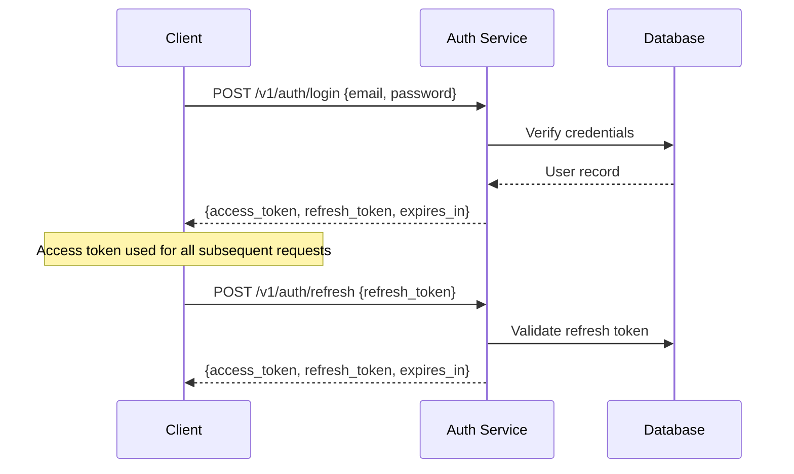

# API Specification

**Project:** Footprint Lens
**Version:** 1.0
**Date:** June 2026
**Base URL:** `https://api.footprintlens.app/v1`
**Protocol:** REST (OpenAPI 3.1 compatible) + tRPC (internal)

---

## 1. API Design Principles

1. **REST for external consumers** — Mobile apps, third-party integrations, webhooks
2. **tRPC for web client** — End-to-end type safety with zero code generation
3. **JSON:API-inspired** — Consistent response envelopes, pagination, error formats
4. **Versioned** — URL-path versioning (`/v1/`); breaking changes require a new version
5. **Idempotent** — All write operations support idempotency keys via `Idempotency-Key` header

---

## 2. Authentication

### 2.1 Authentication Flow



### 2.2 Token Specification

| Token | Type | Lifetime | Storage |
|:---|:---|:---|:---|
| Access Token | JWT (RS256) | 15 minutes | Memory (never localStorage) |
| Refresh Token | Opaque (stored in DB) | 30 days | HttpOnly Secure cookie |

### 2.3 JWT Claims

```json
{
  "sub": "user-uuid",
  "iat": 1719532800,
  "exp": 1719533700,
  "iss": "footprintlens.app",
  "plan": "premium",
  "anonymous": false
}
```

### 2.4 Authentication Headers

```
Authorization: Bearer <access_token>
```

---

## 3. Common Response Envelope

### Success Response

```json
{
  "data": { ... },
  "meta": {
    "request_id": "req_abc123",
    "timestamp": "2026-06-15T10:30:00Z"
  }
}
```

### Paginated Response

```json
{
  "data": [ ... ],
  "meta": {
    "request_id": "req_abc123",
    "timestamp": "2026-06-15T10:30:00Z"
  },
  "pagination": {
    "page": 1,
    "per_page": 20,
    "total": 142,
    "total_pages": 8,
    "has_next": true,
    "has_prev": false
  }
}
```

### Error Response

```json
{
  "error": {
    "code": "VALIDATION_ERROR",
    "message": "Invalid email format",
    "details": [
      {
        "field": "email",
        "message": "Must be a valid email address",
        "code": "invalid_format"
      }
    ]
  },
  "meta": {
    "request_id": "req_abc123",
    "timestamp": "2026-06-15T10:30:00Z"
  }
}
```

---

## 4. Error Codes

| HTTP Status | Error Code | Description |
|:---|:---|:---|
| 400 | `VALIDATION_ERROR` | Request body/params failed validation |
| 400 | `BAD_REQUEST` | Malformed request |
| 401 | `UNAUTHORIZED` | Missing or invalid authentication |
| 401 | `TOKEN_EXPIRED` | Access token has expired |
| 403 | `FORBIDDEN` | Authenticated but lacks permission |
| 403 | `PREMIUM_REQUIRED` | Feature requires premium subscription |
| 404 | `NOT_FOUND` | Resource does not exist |
| 409 | `CONFLICT` | Resource already exists (duplicate) |
| 422 | `UNPROCESSABLE` | Valid syntax but semantically incorrect |
| 429 | `RATE_LIMITED` | Too many requests |
| 500 | `INTERNAL_ERROR` | Unexpected server error |
| 502 | `UPSTREAM_ERROR` | Third-party service failure |
| 503 | `SERVICE_UNAVAILABLE` | Temporary maintenance |

---

## 5. Rate Limiting

### 5.1 Rate Limit Tiers

| Tier | Limit | Window | Applies To |
|:---|:---|:---|:---|
| Anonymous | 30 requests | 1 minute | Unauthenticated endpoints |
| Free | 100 requests | 1 minute | Authenticated free users |
| Premium | 300 requests | 1 minute | Premium subscribers |
| Receipt Scan | 20 scans | 1 hour | OCR-intensive endpoint |

### 5.2 Rate Limit Headers

```
X-RateLimit-Limit: 100
X-RateLimit-Remaining: 87
X-RateLimit-Reset: 1719533700
Retry-After: 30
```

---

## 6. REST API Endpoints

### 6.1 Authentication

#### `POST /v1/auth/register`

Register a new user account.

**Request:**
```json
{
  "email": "user@example.com",
  "password": "securePassword123!",
  "timezone": "America/New_York"
}
```

**Response (201):**
```json
{
  "data": {
    "user": {
      "id": "uuid",
      "email": "user@example.com",
      "is_anonymous": false,
      "created_at": "2026-06-15T10:30:00Z"
    },
    "access_token": "eyJ...",
    "refresh_token": "rt_...",
    "expires_in": 900
  }
}
```

---

#### `POST /v1/auth/login`

Authenticate an existing user.

**Request:**
```json
{
  "email": "user@example.com",
  "password": "securePassword123!"
}
```

**Response (200):**
```json
{
  "data": {
    "user": { "id": "uuid", "email": "user@example.com", "plan": "free" },
    "access_token": "eyJ...",
    "refresh_token": "rt_...",
    "expires_in": 900
  }
}
```

---

#### `POST /v1/auth/oauth`

Authenticate via OAuth provider.

**Request:**
```json
{
  "provider": "google",
  "id_token": "google-oauth-token"
}
```

---

#### `POST /v1/auth/refresh`

Refresh an expired access token.

**Request:**
```json
{
  "refresh_token": "rt_..."
}
```

---

#### `POST /v1/auth/logout`

Invalidate the current session.

---

#### `POST /v1/auth/anonymous`

Create an anonymous session for onboarding.

**Response (201):**
```json
{
  "data": {
    "user": { "id": "uuid", "is_anonymous": true },
    "access_token": "eyJ...",
    "expires_in": 900
  }
}
```

---

### 6.2 User Profile

#### `GET /v1/profile`

Get the authenticated user's profile.

**Response (200):**
```json
{
  "data": {
    "id": "uuid",
    "email": "user@example.com",
    "profile": {
      "home_type": "apartment",
      "primary_transport": "transit",
      "diet_type": "flexitarian",
      "flight_frequency": "1-3",
      "shopping_habit": "average",
      "accuracy_score": 78,
      "total_co2_reduced_kg": 1204.50,
      "forest_tree_count": 12,
      "region": "US-NY",
      "onboarding_completed_at": "2026-01-15T12:00:00Z"
    },
    "preferences": {
      "theme": "light",
      "notification_frequency": "daily",
      "pause_mode": false
    },
    "subscription": {
      "plan": "premium",
      "status": "active",
      "current_period_end": "2026-07-15T00:00:00Z"
    }
  }
}
```

---

#### `PATCH /v1/profile`

Update user profile (onboarding or subsequent edits).

**Request:**
```json
{
  "home_type": "apartment",
  "primary_transport": "transit",
  "diet_type": "flexitarian",
  "flight_frequency": "1-3",
  "shopping_habit": "average"
}
```

---

#### `PATCH /v1/profile/preferences`

Update user preferences.

**Request:**
```json
{
  "theme": "dark",
  "notification_frequency": "weekly",
  "pause_mode": true,
  "pause_until": "2026-07-15T00:00:00Z"
}
```

---

#### `DELETE /v1/profile`

Request account deletion (GDPR). Initiates 30-day grace period.

---

#### `GET /v1/profile/export`

Export all user data as JSON (GDPR data portability).

---

### 6.3 Data Sources

#### `GET /v1/data-sources`

List all connected data sources.

**Response (200):**
```json
{
  "data": [
    {
      "id": "uuid",
      "source_type": "bank",
      "provider": "plaid",
      "status": "active",
      "last_sync_at": "2026-06-15T06:00:00Z",
      "created_at": "2026-01-15T12:00:00Z"
    },
    {
      "id": "uuid",
      "source_type": "utility",
      "provider": "utilityapi",
      "status": "active",
      "last_sync_at": "2026-06-01T00:00:00Z",
      "created_at": "2026-02-20T10:00:00Z"
    }
  ]
}
```

---

#### `POST /v1/data-sources/bank/link`

Initiate Plaid Link flow.

**Response (200):**
```json
{
  "data": {
    "link_token": "link-sandbox-...",
    "expiration": "2026-06-15T11:00:00Z"
  }
}
```

---

#### `POST /v1/data-sources/bank/exchange`

Exchange Plaid public token for access.

**Request:**
```json
{
  "public_token": "public-sandbox-...",
  "institution_id": "ins_123"
}
```

---

#### `DELETE /v1/data-sources/:id`

Disconnect a data source.

---

### 6.4 Carbon Data (Dashboard)

#### `GET /v1/carbon/summary`

Get the user's carbon footprint summary.

**Query Parameters:**
| Param | Type | Default | Description |
|:---|:---|:---|:---|
| `period` | string | `month` | `day`, `week`, `month`, `year` |
| `date` | string | current | ISO date for the period |
| `compare` | boolean | `true` | Include comparison with previous period |

**Response (200):**
```json
{
  "data": {
    "period": "month",
    "date": "2026-06",
    "total_co2e_kg": 820.00,
    "previous_period_co2e_kg": 1140.00,
    "delta_percent": -28.07,
    "accuracy_score": 78,
    "breakdown": [
      { "category": "transport", "co2e_kg": 312.40, "percent": 38.1 },
      { "category": "diet", "co2e_kg": 205.00, "percent": 25.0 },
      { "category": "energy", "co2e_kg": 180.60, "percent": 22.0 },
      { "category": "shopping", "co2e_kg": 82.00, "percent": 10.0 },
      { "category": "other", "co2e_kg": 40.00, "percent": 4.9 }
    ],
    "equivalences": {
      "balloons": 462800,
      "arctic_ice_sqft": 26.24,
      "trees_working_year": 4.1,
      "shower_hours": 246,
      "miles_driven": 2050
    },
    "trend": [
      { "date": "2026-01", "co2e_kg": 1420.00 },
      { "date": "2026-02", "co2e_kg": 1280.00 },
      { "date": "2026-03", "co2e_kg": 1100.00 },
      { "date": "2026-04", "co2e_kg": 980.00 },
      { "date": "2026-05", "co2e_kg": 900.00 },
      { "date": "2026-06", "co2e_kg": 820.00 }
    ],
    "projected_annual_co2e_kg": 8300.00
  }
}
```

---

#### `GET /v1/carbon/transactions`

Get carbon-tagged transactions.

**Query Parameters:**
| Param | Type | Default | Description |
|:---|:---|:---|:---|
| `page` | integer | 1 | Page number |
| `per_page` | integer | 20 | Items per page (max 100) |
| `start_date` | string | - | Filter start date |
| `end_date` | string | - | Filter end date |
| `category` | string | - | Filter by carbon category |

**Response (200):**
```json
{
  "data": [
    {
      "id": "uuid",
      "merchant_name": "Shell Gas Station",
      "category": "transport",
      "subcategory": "fuel",
      "amount": 45.00,
      "currency": "USD",
      "co2e_kg": 38.20,
      "transaction_date": "2026-06-14",
      "impact_level": "high",
      "user_corrected": false,
      "equivalence": "Driving 95 miles"
    }
  ],
  "pagination": { "page": 1, "per_page": 20, "total": 142, "total_pages": 8 }
}
```

---

#### `PATCH /v1/carbon/transactions/:id/correct`

Correct a transaction's category.

**Request:**
```json
{
  "correct_category": "food",
  "correct_subcategory": "delivery",
  "note": "This Uber charge was Uber Eats, not a ride"
}
```

---

#### `GET /v1/carbon/time-machine`

Get Time Machine projection data.

**Response (200):**
```json
{
  "data": {
    "history": [
      { "date": "2026-01", "annual_rate_kg": 14200 },
      { "date": "2026-06", "annual_rate_kg": 11800 }
    ],
    "projected": [
      { "date": "2026-12", "annual_rate_kg": 8300, "scenario": "current_pace" },
      { "date": "2026-12", "annual_rate_kg": 6500, "scenario": "all_actions_completed" }
    ],
    "budget_1_5c_kg": 2300
  }
}
```

---

### 6.5 Receipt Scanning

#### `POST /v1/receipts/scan`

Upload and process a receipt image.

**Request:** `multipart/form-data`
| Field | Type | Description |
|:---|:---|:---|
| `image` | file | Receipt image (JPEG/PNG, max 10MB) |

**Response (202):**
```json
{
  "data": {
    "scan_id": "uuid",
    "status": "processing"
  }
}
```

---

#### `GET /v1/receipts/:scan_id`

Get receipt scan results.

**Response (200):**
```json
{
  "data": {
    "id": "uuid",
    "status": "completed",
    "scanned_at": "2026-06-15T10:30:00Z",
    "items": [
      {
        "item_name": "Beef Mince 500g",
        "quantity": 1,
        "price": 6.49,
        "co2e_kg": 13.00,
        "impact_level": "high",
        "suggested_swap": "Red Lentils 500g",
        "swap_co2e_kg": 0.90,
        "reduction_percent": 93
      },
      {
        "item_name": "Organic Oat Milk 1L",
        "quantity": 2,
        "price": 3.99,
        "co2e_kg": 0.60,
        "impact_level": "low",
        "suggested_swap": null,
        "swap_co2e_kg": null,
        "reduction_percent": null
      }
    ],
    "total_co2e_kg": 18.40,
    "potential_co2e_kg": 5.20,
    "potential_reduction_percent": 71.7
  }
}
```

---

#### `GET /v1/receipts`

List receipt scan history. Paginated.

---

### 6.6 Action Engine

#### `GET /v1/actions/current`

Get the currently recommended action.

**Response (200):**
```json
{
  "data": {
    "id": "uuid",
    "action_id": "uuid",
    "tier": {
      "name": "Light Switches",
      "level": 1,
      "icon": "🟢",
      "color": "#5B8C5A"
    },
    "title": "Swap to oat milk",
    "description": "Your usual almond milk ships from 1,400 miles away. Local oat milk is same price, 68% less carbon.",
    "impact_description": "This swap, done weekly for a year, is the equivalent of keeping one mature oak tree standing.",
    "category": "diet",
    "estimated_co2e_reduction_kg": 2.10,
    "estimated_time_minutes": 3,
    "context": "grocery_shopping"
  }
}
```

---

#### `POST /v1/actions/:id/complete`

Mark an action as completed.

**Request:**
```json
{
  "actual_co2e_saved_kg": 2.10,
  "note": "Switched to Oatly at Whole Foods"
}
```

**Response (200):**
```json
{
  "data": {
    "status": "completed",
    "co2e_saved_kg": 2.10,
    "total_actions_completed": 6,
    "tier_progress": {
      "current_tier": "Light Switches",
      "completed": 6,
      "required_to_unlock_next": 8,
      "next_tier_unlocked": false
    },
    "forest_update": {
      "new_tree": false,
      "progress_to_next_tree_percent": 72
    }
  }
}
```

---

#### `POST /v1/actions/:id/dismiss`

Dismiss the current action.

**Request:**
```json
{
  "reason": "not_applicable"
}
```

---

#### `GET /v1/actions/history`

Get action completion history. Paginated.

---

#### `GET /v1/actions/tiers`

Get tier progression status.

**Response (200):**
```json
{
  "data": [
    {
      "name": "Light Switches",
      "level": 1,
      "icon": "🟢",
      "status": "unlocked",
      "completed": 6,
      "total": 8
    },
    {
      "name": "Habit Builders",
      "level": 2,
      "icon": "🟡",
      "status": "locked",
      "unlock_at": 8,
      "completed": 0,
      "total": 12
    },
    {
      "name": "Lifestyle Levers",
      "level": 3,
      "icon": "🔴",
      "status": "locked",
      "unlock_at": "tier_2_unlocked",
      "completed": 0,
      "total": 10
    }
  ]
}
```

---

### 6.7 Cohorts (Social)

#### `POST /v1/cohorts`

Create a new cohort.

**Request:**
```json
{
  "name": "Oak Street Crew",
  "type": "friends_family",
  "max_members": 8
}
```

---

#### `GET /v1/cohorts/mine`

Get the user's current cohort.

**Response (200):**
```json
{
  "data": {
    "id": "uuid",
    "name": "Oak Street Crew",
    "type": "friends_family",
    "invite_code": "OAK-2026-XY",
    "member_count": 6,
    "members": [
      { "avatar_color": "#5B8C5A", "avatar_shape": "organic_blob_1", "is_you": true },
      { "avatar_color": "#C67B5C", "avatar_shape": "organic_blob_2", "is_you": false },
      { "avatar_color": "#7BA7BC", "avatar_shape": "organic_blob_3", "is_you": false }
    ],
    "current_quest": {
      "id": "uuid",
      "title": "Keep Our Park Breathing",
      "type": "conservation_anchor",
      "progress_percent": 73,
      "target_co2e_kg": 500,
      "current_co2e_kg": 365,
      "end_date": "2026-06-30"
    },
    "formed_at": "2026-10-01T00:00:00Z"
  }
}
```

---

#### `POST /v1/cohorts/join`

Join a cohort via invite code.

**Request:**
```json
{
  "invite_code": "OAK-2026-XY"
}
```

---

#### `DELETE /v1/cohorts/leave`

Leave current cohort.

---

#### `GET /v1/cohorts/feed`

Get the anonymized cohort activity feed.

**Response (200):**
```json
{
  "data": [
    {
      "id": "uuid",
      "type": "action_completed",
      "description": "Someone swapped to oat milk",
      "co2e_saved_kg": 2.10,
      "icon": "🟢",
      "timestamp": "2026-06-15T10:30:00Z"
    },
    {
      "id": "uuid",
      "type": "action_completed",
      "description": "Someone biked to work instead of driving",
      "co2e_saved_kg": 4.80,
      "icon": "🟡",
      "timestamp": "2026-06-15T08:15:00Z"
    }
  ]
}
```

---

#### `GET /v1/cohorts/quest`

Get current quest details with progress.

---

### 6.8 Impact & Forest

#### `GET /v1/impact/forest`

Get the user's Living Forest data.

**Response (200):**
```json
{
  "data": {
    "tree_count": 12,
    "total_co2e_reduced_kg": 1204.50,
    "trees": [
      {
        "id": "uuid",
        "species": "oak",
        "category": "diet",
        "co2e_kg": 100,
        "position": { "x": 120, "y": 80 },
        "is_milestone": false,
        "planted_at": "2026-02-15T00:00:00Z"
      }
    ],
    "wildlife": [
      { "type": "fox", "unlocked_at_kg": 1000, "unlocked": true }
    ],
    "next_milestone": {
      "type": "deer",
      "required_kg": 5000,
      "current_kg": 1204.50,
      "progress_percent": 24.1
    }
  }
}
```

---

#### `GET /v1/impact/collective`

Get platform-wide collective impact.

**Response (200):**
```json
{
  "data": {
    "period": "2026-06",
    "total_co2e_reduced_kg": 847000,
    "active_users": 12400,
    "projects": [
      {
        "partner": "Pachama",
        "project_name": "Amazon Rainforest Protection",
        "area_protected_acres": 12,
        "verification_url": "https://pachama.com/verify/FL-2026-0847",
        "satellite_image_url": "https://cdn.footprintlens.app/impact/satellite-jun2026.jpg"
      },
      {
        "partner": "Climeworks",
        "project_name": "Direct Air Capture",
        "co2e_captured_kg": 2400,
        "certificate_id": "FL-2026-0847"
      }
    ],
    "user_contribution": {
      "co2e_reduced_kg": 48,
      "equivalent": "6.2 square feet of rainforest canopy"
    }
  }
}
```

---

#### `GET /v1/impact/reports`

List published monthly impact reports.

---

#### `POST /v1/impact/vote`

Cast a quarterly vote on funding allocation.

**Request:**
```json
{
  "quarter": 3,
  "year": 2026,
  "category": "reforestation"
}
```

---

### 6.9 Subscriptions

#### `POST /v1/subscriptions/checkout`

Create a subscription checkout session.

**Request:**
```json
{
  "plan": "premium",
  "payment_provider": "stripe"
}
```

**Response (200):**
```json
{
  "data": {
    "checkout_url": "https://checkout.stripe.com/c/pay/...",
    "session_id": "cs_..."
  }
}
```

---

#### `GET /v1/subscriptions/status`

Get current subscription status.

---

#### `POST /v1/subscriptions/cancel`

Cancel active subscription (effective at period end).

---

### 6.10 Notifications

#### `GET /v1/notifications`

Get notification feed. Paginated.

**Query Parameters:**
| Param | Type | Default | Description |
|:---|:---|:---|:---|
| `unread_only` | boolean | false | Filter to unread notifications |

---

#### `PATCH /v1/notifications/:id/read`

Mark a notification as read.

---

#### `PATCH /v1/notifications/read-all`

Mark all notifications as read.

---

### 6.11 Lens & Equivalences

#### `GET /v1/lens/equivalences`

Get equivalence translations for a given CO₂ value.

**Query Parameters:**
| Param | Type | Required | Description |
|:---|:---|:---|:---|
| `co2e_kg` | number | yes | The CO₂e value to translate |

**Response (200):**
```json
{
  "data": {
    "co2e_kg": 820,
    "equivalences": [
      { "type": "balloons", "value": 462800, "label": "462,800 party balloons" },
      { "type": "arctic_ice", "value": 26.24, "unit": "sq ft", "label": "26 sq ft of Arctic ice" },
      { "type": "trees", "value": 4.1, "label": "4.1 trees working all year" },
      { "type": "shower_hours", "value": 246, "label": "246 hours of hot shower" },
      { "type": "miles_driven", "value": 2050, "label": "2,050 miles driven" },
      { "type": "beef_burgers", "value": 63, "label": "63 beef burgers" }
    ]
  }
}
```

---

### 6.12 Webhooks (Inbound)

#### `POST /v1/webhooks/plaid`

Receive Plaid transaction webhooks.

**Headers:**
```
Plaid-Verification: <signature>
```

---

#### `POST /v1/webhooks/stripe`

Receive Stripe subscription webhooks.

**Headers:**
```
Stripe-Signature: <signature>
```

---

## 7. OpenAPI Specification (Excerpt)

```yaml
openapi: "3.1.0"
info:
  title: Footprint Lens API
  version: "1.0.0"
  description: Personal carbon intelligence platform API
  contact:
    name: Footprint Lens Engineering
    email: api@footprintlens.app
  license:
    name: Proprietary

servers:
  - url: https://api.footprintlens.app/v1
    description: Production
  - url: https://staging-api.footprintlens.app/v1
    description: Staging
  - url: http://localhost:3000/api/v1
    description: Local Development

security:
  - bearerAuth: []

components:
  securitySchemes:
    bearerAuth:
      type: http
      scheme: bearer
      bearerFormat: JWT

  schemas:
    CarbonSummary:
      type: object
      properties:
        period:
          type: string
          enum: [day, week, month, year]
        date:
          type: string
          format: date
        total_co2e_kg:
          type: number
          format: double
        previous_period_co2e_kg:
          type: number
          format: double
        delta_percent:
          type: number
          format: double
        accuracy_score:
          type: integer
          minimum: 0
          maximum: 100
        breakdown:
          type: array
          items:
            $ref: "#/components/schemas/CategoryBreakdown"
        equivalences:
          $ref: "#/components/schemas/Equivalences"

    CategoryBreakdown:
      type: object
      properties:
        category:
          type: string
        co2e_kg:
          type: number
        percent:
          type: number

    Equivalences:
      type: object
      properties:
        balloons:
          type: integer
        arctic_ice_sqft:
          type: number
        trees_working_year:
          type: number
        shower_hours:
          type: integer
        miles_driven:
          type: integer

    Error:
      type: object
      properties:
        code:
          type: string
        message:
          type: string
        details:
          type: array
          items:
            type: object
            properties:
              field:
                type: string
              message:
                type: string
              code:
                type: string

paths:
  /carbon/summary:
    get:
      summary: Get carbon footprint summary
      operationId: getCarbonSummary
      tags:
        - Carbon
      parameters:
        - name: period
          in: query
          schema:
            type: string
            enum: [day, week, month, year]
            default: month
        - name: date
          in: query
          schema:
            type: string
            format: date
      responses:
        "200":
          description: Carbon summary data
          content:
            application/json:
              schema:
                type: object
                properties:
                  data:
                    $ref: "#/components/schemas/CarbonSummary"
        "401":
          description: Unauthorized
```

---

*Document maintained by the Engineering Team. Last updated: June 2026.*
