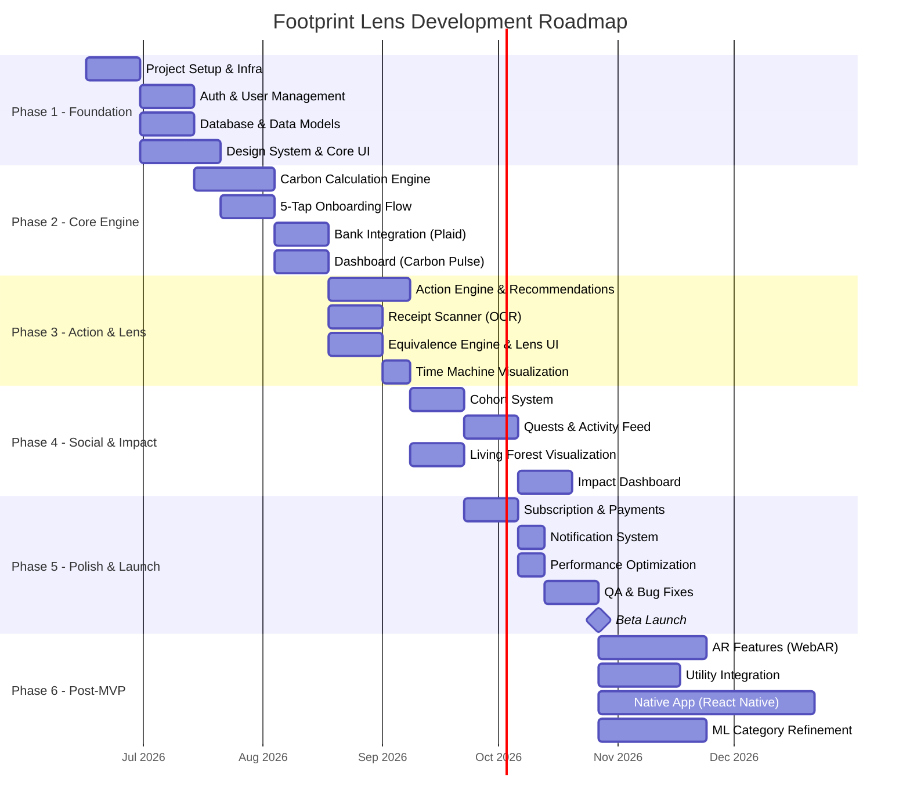
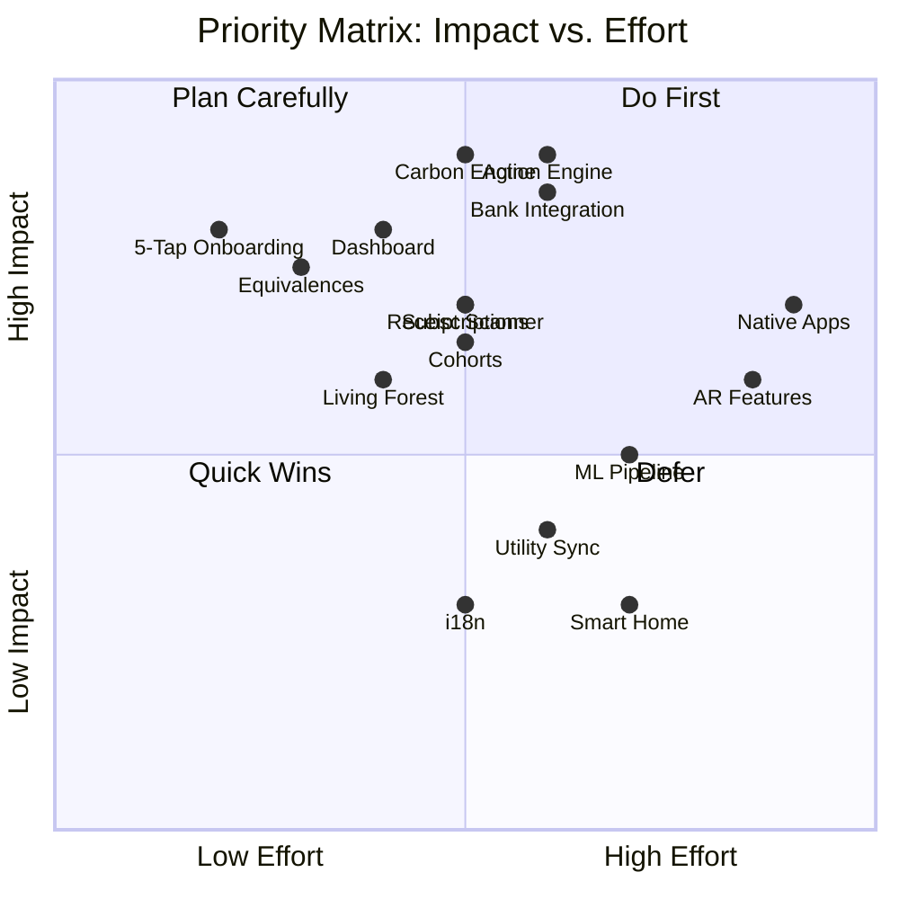
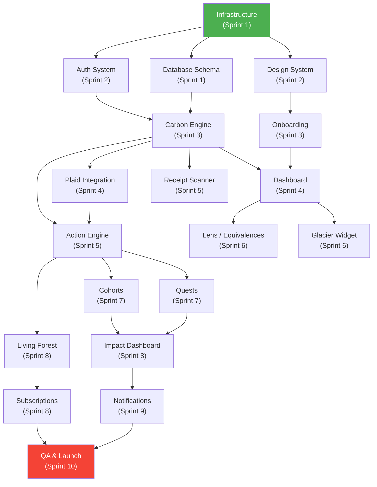

# Development Roadmap

**Project:** Footprint Lens
**Version:** 1.0
**Date:** June 2026
**Status:** Draft

---

## 1. Roadmap Overview

---

## 2. Phase Breakdown

### Phase 1: Foundation (Weeks 1–4)

**Goal:** Establish the technical foundation, deployment pipeline, and design system.

| Sprint | Duration | Deliverables |
|:---|:---|:---|
| Sprint 1 (W1–W2) | 2 weeks | Project scaffolding (Next.js, TypeScript, Tailwind), PostgreSQL schema (Drizzle), CI/CD pipeline (GitHub Actions → Vercel), dev/staging environments on Neon branches |
| Sprint 2 (W3–W4) | 2 weeks | Auth system (NextAuth.js — Google, Apple, email, anonymous sessions), design system components (color palette, typography, card, button, nav), responsive layout shell |

**Exit Criteria:**
- [ ] `npm run dev` starts the app with a functional auth flow
- [ ] Design system storybook or component gallery rendered
- [ ] CI/CD deploys to staging on push to `develop`
- [ ] Database migrations run via Drizzle Kit

---

### Phase 2: Core Engine (Weeks 5–8)

**Goal:** Build the carbon calculation pipeline and primary dashboard.

| Sprint | Duration | Deliverables |
|:---|:---|:---|
| Sprint 3 (W5–W6) | 2 weeks | Carbon Calculation Engine (transaction → category → emission factor → kg CO₂e), emission factor seeding (DEFRA + Climatiq), 5-Tap Onboarding UI (card-swipe, profile seeding) |
| Sprint 4 (W7–W8) | 2 weeks | Plaid integration (Link flow, webhook handler, transaction sync), Carbon Pulse dashboard (monthly summary, delta badge, category breakdown), accuracy score display |

**Exit Criteria:**
- [ ] A user can complete onboarding and see a 55% accuracy estimate
- [ ] Plaid sandbox connected; test transactions flowing through carbon engine
- [ ] Dashboard shows monthly footprint with category breakdown
- [ ] Accuracy score updates when bank is connected

**Dependencies:**
- Plaid developer account and API keys
- Climatiq API key
- DEFRA emission factor data imported

---

### Phase 3: Action & Lens (Weeks 9–12)

**Goal:** Deliver the coaching system and visualization features.

| Sprint | Duration | Deliverables |
|:---|:---|:---|
| Sprint 5 (W9–W10) | 2 weeks | Action Engine (recommendation algorithm, tier progression, completion/dismissal tracking), Action Library seeded (~30 actions across Tier 1 & 2), receipt scanning (camera capture → Google Vision OCR → item tagging) |
| Sprint 6 (W11–W12) | 2 weeks | Equivalence Engine (CO₂ → physical metaphors), Lens UI (equivalence cards, Receipt Lens with color auras), Time Machine timeline visualization, glacier widget (SVG/Lottie) |

**Exit Criteria:**
- [ ] User receives personalized action recommendations based on their data
- [ ] Tier progression works (locked → unlocked with frosted glass UI)
- [ ] Receipt scan completes in ≤ 3 seconds with item-level carbon tags
- [ ] Lens screen shows equivalences and Time Machine
- [ ] Glacier widget renders on Home screen

**Dependencies:**
- Google Vision API key
- Open Food Facts product data available
- Lottie/SVG animations for glacier designed

---

### Phase 4: Social & Impact (Weeks 13–16)

**Goal:** Launch cohort features and impact tracking.

| Sprint | Duration | Deliverables |
|:---|:---|:---|
| Sprint 7 (W13–W14) | 2 weeks | Cohort CRUD (create, invite, join, leave), quest system (conservation anchor, offset race, swap sprint), anonymous activity feed, ripple notifications |
| Sprint 8 (W15–W16) | 2 weeks | Living Forest visualization (procedural tree generation, milestone wildlife), collective impact dashboard, impact report display with verification links, subscription flow (Stripe checkout) |

**Exit Criteria:**
- [ ] Users can create/join cohorts via invite code
- [ ] Active quest with collective progress bar
- [ ] Anonymous activity feed updating in near-real-time
- [ ] Living Forest renders with trees and fox milestone
- [ ] Stripe subscription flow works end-to-end
- [ ] Impact page shows collective stats and verification links

**Dependencies:**
- Stripe account and API keys
- Impact partner API access (Gold Standard/Pachama — can use mock data for MVP)

---

### Phase 5: Polish & Launch (Weeks 17–20)

**Goal:** Production hardening, performance optimization, beta launch.

| Sprint | Duration | Deliverables |
|:---|:---|:---|
| Sprint 9 (W17–W18) | 2 weeks | Push notification system (web push via FCM), email digest templates (weekly summary), performance audit (Core Web Vitals optimization), dark mode implementation |
| Sprint 10 (W19–W20) | 2 weeks | Full QA cycle (unit, integration, E2E tests), security audit (OWASP top 10 checklist), accessibility audit (WCAG 2.1 AA), bug fixes, beta launch |

**Exit Criteria:**
- [ ] Lighthouse score ≥ 90 on all categories
- [ ] Zero critical/high severity bugs
- [ ] WCAG 2.1 AA compliance verified
- [ ] Beta users onboarded and providing feedback
- [ ] Monitoring and alerting operational

---

### Phase 6: Post-MVP (Weeks 21+)

| Feature | Duration | Priority |
|:---|:---|:---|
| AR Features (WebAR balloon fill, enhanced glacier) | 4 weeks | P1 |
| Utility Integration (UtilityAPI, Green Button Connect) | 3 weeks | P1 |
| Smart Home Sync (Nest, Ecobee) | 3 weeks | P2 |
| ML Category Refinement Pipeline | 4 weeks | P2 |
| Native Mobile App (React Native + Expo) | 8 weeks | P1 |
| Flight Detection (Gmail/Calendar parsing) | 2 weeks | P2 |
| Impact Fund Voting | 2 weeks | P2 |
| Workplace / Enterprise Cohorts | 4 weeks | P3 |
| Internationalization (i18n) | 3 weeks | P2 |

---

## 3. MVP Scope Definition

### In Scope (MVP)

| Feature | Description |
|:---|:---|
| ✅ Anonymous onboarding | Session-first, account later |
| ✅ 5-Tap Profile | Card-swipe lifestyle assessment |
| ✅ Bank integration | Plaid Link + transaction sync |
| ✅ Carbon calculation | Transaction → category → CO₂e |
| ✅ Carbon Pulse dashboard | Monthly summary, delta, breakdown |
| ✅ Accuracy score | Progressive fidelity meter |
| ✅ Action Engine | Recommendations, 3-tier progression |
| ✅ Receipt scanner | Camera OCR + item tagging |
| ✅ Equivalence Engine | CO₂ → physical metaphors |
| ✅ Lens UI | Equivalence cards, Receipt Lens |
| ✅ Time Machine | Timeline visualization |
| ✅ Glacier widget | Animated SVG/Lottie |
| ✅ Cohorts | Create, join, leave |
| ✅ Quests | 3 quest types with progress |
| ✅ Activity feed | Anonymous cohort feed |
| ✅ Living Forest | Procedural tree visualization |
| ✅ Collective impact | Platform-wide stats |
| ✅ Subscription | Stripe-powered freemium |
| ✅ Dark mode | Full dark theme |
| ✅ Responsive design | Mobile, tablet, desktop |
| ✅ Notifications | Web push + in-app |

### Out of Scope (MVP → Phase 6)

| Feature | Reason |
|:---|:---|
| ❌ AR camera features | WebAR quality insufficient for flagship status; needs native |
| ❌ Utility integration | Requires UtilityAPI partnership negotiation |
| ❌ Smart home sync | Hardware dependency; limited user base |
| ❌ Native mobile apps | Web-first strategy; native in Phase 6 |
| ❌ ML refinement | Initial rule-based mapping sufficient for MVP |
| ❌ Flight detection | Calendar/email parsing complexity; manual entry sufficient |
| ❌ Blockchain ledger | Impact verification via partner certificates sufficient |
| ❌ Quarterly voting | Manual allocation for early months |
| ❌ i18n | English-only for initial launch |

---

## 4. Sprint Breakdown Summary

| Sprint | Weeks | Focus | Key Deliverable |
|:---|:---|:---|:---|
| Sprint 1 | W1–W2 | Infrastructure | Project scaffold, DB schema, CI/CD |
| Sprint 2 | W3–W4 | Auth & Design | Auth flow, design system, layout |
| Sprint 3 | W5–W6 | Carbon Core | Calculation engine, onboarding |
| Sprint 4 | W7–W8 | Data & Dashboard | Plaid integration, Carbon Pulse |
| Sprint 5 | W9–W10 | Coaching | Action Engine, receipt scanner |
| Sprint 6 | W11–W12 | Visualization | Lens, Time Machine, glacier |
| Sprint 7 | W13–W14 | Social | Cohorts, quests, feed |
| Sprint 8 | W15–W16 | Impact | Forest, impact, subscriptions |
| Sprint 9 | W17–W18 | Polish | Notifications, dark mode, perf |
| Sprint 10 | W19–W20 | Launch | QA, security audit, beta launch |

---

## 5. Priority Matrix

---

## 6. Dependency Graph

---

## 7. Risk Register

| Risk | Probability | Impact | Mitigation |
|:---|:---|:---|:---|
| Plaid API rate limits or downtime | Medium | High | Implement circuit breaker; cache transactions; manual entry fallback |
| OCR accuracy on poor receipt quality | High | Medium | Fallback to manual item entry; suggest re-scan with tips |
| Carbon calculation accuracy questioned | Medium | High | Publish methodology; link to source databases; allow user corrections |
| Low onboarding completion rate | Medium | High | A/B test onboarding flows; reduce to 3-Tap minimum |
| Plaid costs exceed budget | Low | Medium | Negotiate startup pricing; limit sync frequency; defer to Phase 2 for edge cases |
| Team velocity lower than planned | Medium | Medium | Cut scope from Phase 4/5 (defer quests, reduce quest types to 1) |
| Third-party API breaking changes | Low | High | Pin API versions; integration tests; monitoring alerts |

---

## 8. Success Metrics (MVP)

| Metric | Target | Measurement |
|:---|:---|:---|
| Onboarding completion rate | ≥ 70% | Analytics: users completing 5-Tap → dashboard |
| Bank connection rate | ≥ 40% of registered users | Analytics: Plaid Link completions |
| Weekly active users (W4 post-launch) | ≥ 500 | Analytics: unique sessions / week |
| Action completion rate | ≥ 30% of shown actions | Analytics: completed / shown ratio |
| Receipt scan usage | ≥ 1 scan per active user per week | Analytics: scan events |
| Cohort join rate | ≥ 20% of registered users | Analytics: cohort membership |
| Premium conversion rate | ≥ 5% of MAU | Stripe: subscription events |
| App Lighthouse score | ≥ 90 all categories | Automated CI check |
| P95 API latency | ≤ 200ms | Monitoring dashboard |

---

*Document maintained by the Product & Engineering Teams. Last updated: June 2026.*
