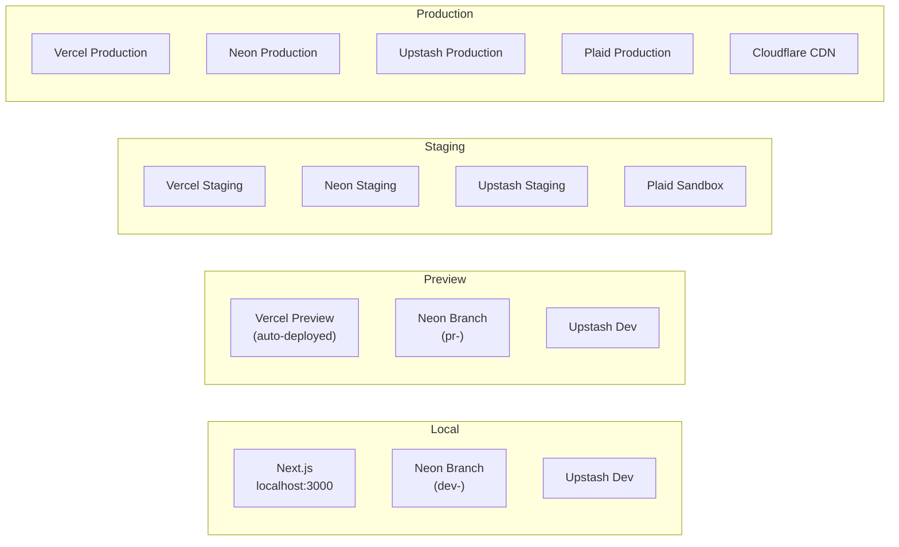
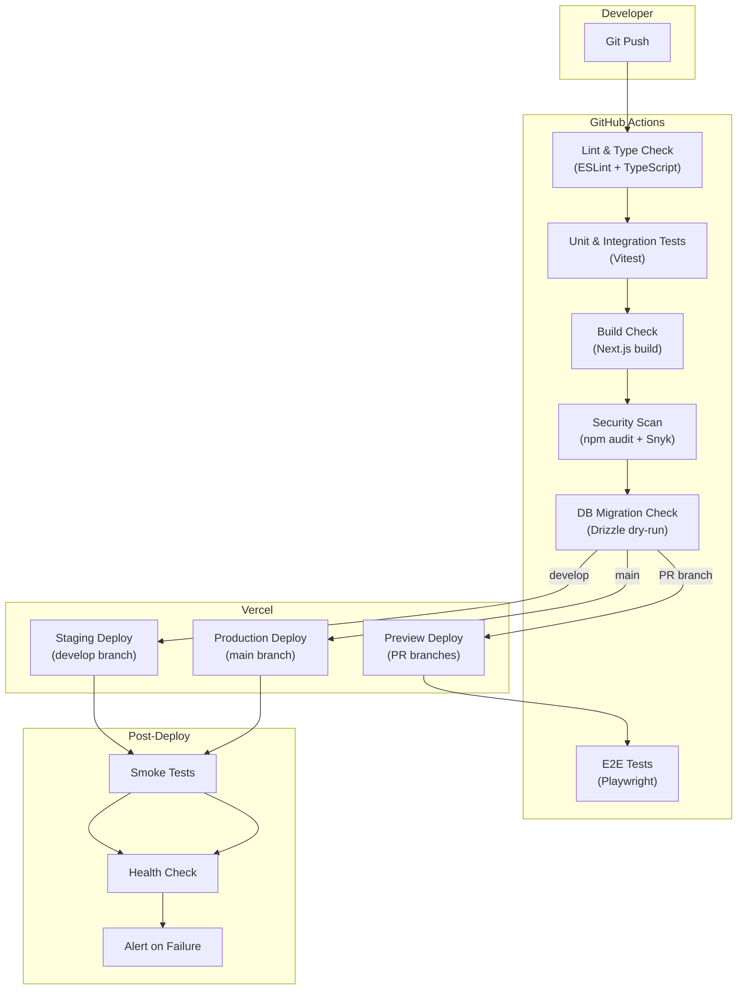
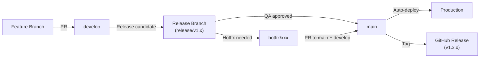
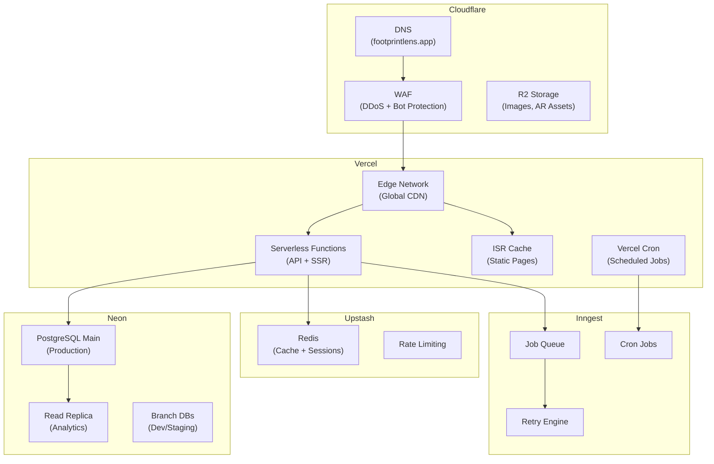

# DevOps & Deployment Document

**Project:** Footprint Lens
**Version:** 1.0
**Date:** June 2026
**Status:** Draft

---

## 1. Environment Strategy

### 1.1 Environment Overview

| Environment | Purpose | URL | Database | Deploy Trigger |
|:---|:---|:---|:---|:---|
| **Local** | Developer workstations | `http://localhost:3000` | Neon branch (per-developer) | Manual |
| **Preview** | PR review environments | `https://<branch>.footprintlens.vercel.app` | Neon branch (ephemeral) | Push to PR branch |
| **Staging** | Pre-production validation | `https://staging.footprintlens.app` | Neon staging branch | Push to `develop` |
| **Production** | Live application | `https://footprintlens.app` | Neon main branch | Push to `main` (via release) |

### 1.2 Environment Configuration



### 1.3 Environment Variables

```bash
# ─── Core ───
NODE_ENV=                       # development | staging | production
NEXT_PUBLIC_APP_URL=            # Base URL of the app
DATABASE_URL=                   # Neon PostgreSQL connection string
DIRECT_DATABASE_URL=            # Direct connection (for migrations)

# ─── Auth ───
NEXTAUTH_SECRET=                # Auth.js secret key
NEXTAUTH_URL=                   # Auth callback URL
GOOGLE_CLIENT_ID=               # Google OAuth
GOOGLE_CLIENT_SECRET=
APPLE_CLIENT_ID=                # Apple OAuth
APPLE_CLIENT_SECRET=

# ─── Data Integrations ───
PLAID_CLIENT_ID=
PLAID_SECRET=
PLAID_ENV=                      # sandbox | development | production
CLIMATIQ_API_KEY=
ELECTRICITY_MAP_API_KEY=
GOOGLE_VISION_API_KEY=

# ─── Cache & Queue ───
UPSTASH_REDIS_REST_URL=
UPSTASH_REDIS_REST_TOKEN=
INNGEST_EVENT_KEY=
INNGEST_SIGNING_KEY=

# ─── Payments ───
STRIPE_SECRET_KEY=
STRIPE_WEBHOOK_SECRET=
NEXT_PUBLIC_STRIPE_PUBLISHABLE_KEY=

# ─── Storage ───
R2_ACCOUNT_ID=
R2_ACCESS_KEY_ID=
R2_SECRET_ACCESS_KEY=
R2_BUCKET_NAME=

# ─── Monitoring ───
SENTRY_DSN=
SENTRY_AUTH_TOKEN=
NEXT_PUBLIC_POSTHOG_KEY=
NEXT_PUBLIC_POSTHOG_HOST=
```

> **Security Rule:** All secrets are stored in Vercel Environment Variables (encrypted) or a dedicated secrets manager. Never committed to version control.

---

## 2. CI/CD Pipeline

### 2.1 Pipeline Architecture



### 2.2 GitHub Actions Workflow

```yaml
# .github/workflows/ci.yml
name: CI Pipeline

on:
  push:
    branches: [main, develop]
  pull_request:
    branches: [main, develop]

concurrency:
  group: ${{ github.workflow }}-${{ github.ref }}
  cancel-in-progress: true

jobs:
  lint-and-type-check:
    runs-on: ubuntu-latest
    steps:
      - uses: actions/checkout@v4
      - uses: actions/setup-node@v4
        with:
          node-version: "20"
          cache: "npm"
      - run: npm ci
      - run: npm run lint
      - run: npm run type-check

  unit-tests:
    runs-on: ubuntu-latest
    needs: lint-and-type-check
    steps:
      - uses: actions/checkout@v4
      - uses: actions/setup-node@v4
        with:
          node-version: "20"
          cache: "npm"
      - run: npm ci
      - run: npm run test -- --coverage
      - uses: actions/upload-artifact@v4
        with:
          name: coverage
          path: coverage/

  build:
    runs-on: ubuntu-latest
    needs: lint-and-type-check
    steps:
      - uses: actions/checkout@v4
      - uses: actions/setup-node@v4
        with:
          node-version: "20"
          cache: "npm"
      - run: npm ci
      - run: npm run build

  security-scan:
    runs-on: ubuntu-latest
    needs: lint-and-type-check
    steps:
      - uses: actions/checkout@v4
      - run: npm audit --audit-level=high
      - uses: snyk/actions/node@master
        env:
          SNYK_TOKEN: ${{ secrets.SNYK_TOKEN }}

  e2e-tests:
    runs-on: ubuntu-latest
    needs: build
    if: github.event_name == 'pull_request'
    steps:
      - uses: actions/checkout@v4
      - uses: actions/setup-node@v4
        with:
          node-version: "20"
          cache: "npm"
      - run: npm ci
      - run: npx playwright install --with-deps
      - run: npm run test:e2e
      - uses: actions/upload-artifact@v4
        if: failure()
        with:
          name: playwright-report
          path: playwright-report/

  db-migration-check:
    runs-on: ubuntu-latest
    needs: lint-and-type-check
    steps:
      - uses: actions/checkout@v4
      - uses: actions/setup-node@v4
        with:
          node-version: "20"
          cache: "npm"
      - run: npm ci
      - run: npx drizzle-kit check
```

### 2.3 Release Process



| Step | Actor | Action |
|:---|:---|:---|
| 1 | Developer | Creates feature branch from `develop`, opens PR |
| 2 | CI | Runs lint, tests, build, security scan |
| 3 | Reviewer | Code review + approve |
| 4 | Developer | Merges to `develop` → auto-deploys to staging |
| 5 | QA | Tests on staging environment |
| 6 | Tech Lead | Creates release branch `release/v1.x` |
| 7 | QA | Final regression on release branch |
| 8 | Tech Lead | Merges release to `main` → auto-deploys to production |
| 9 | CI | Creates git tag `v1.x.x` and GitHub release |

---

## 3. Hosting Architecture

### 3.1 Infrastructure Stack



### 3.2 Cost Estimation (MVP Scale)

| Service | Plan | Estimated Monthly Cost |
|:---|:---|:---|
| Vercel | Pro ($20/mo) | $20 |
| Neon | Launch ($19/mo) | $19 |
| Upstash Redis | Pay-as-you-go | $5–15 |
| Cloudflare | Free (with R2) | $0–5 |
| Inngest | Free tier | $0 |
| Plaid | Growth (per-connection) | $50–200 |
| Climatiq | Free tier (10K calls/mo) | $0 |
| Google Vision | Pay-per-use | $10–30 |
| Sentry | Developer (free) | $0 |
| PostHog | Free tier (1M events) | $0 |
| **Total (MVP)** | | **~$100–300/mo** |

---

## 4. Monitoring & Logging

### 4.1 Monitoring Stack

| Concern | Tool | Purpose |
|:---|:---|:---|
| Error Tracking | Sentry | Real-time error capture with stack traces, breadcrumbs |
| Performance | Vercel Speed Insights | Core Web Vitals, real-user monitoring |
| Uptime | Better Uptime / Vercel | Endpoint health checks, incident alerts |
| Product Analytics | PostHog | Feature usage, funnels, retention |
| Database | Neon Dashboard | Query performance, connection pools |
| Logs | Vercel Logs + Axiom | Request logs, function logs, structured search |

### 4.2 Alerting Rules

| Alert | Condition | Channel | Severity |
|:---|:---|:---|:---|
| Error rate spike | > 5% error rate over 5 min window | Slack + PagerDuty | Critical |
| API latency degradation | P95 > 500ms for 10 min | Slack | Warning |
| Database connection exhaustion | > 80% connections used | Slack + PagerDuty | Critical |
| Plaid sync failure | 3 consecutive failures for any user | Slack | Warning |
| OCR failure rate | > 20% failure rate over 1 hour | Slack | Warning |
| Deployment failure | Any production deploy fails | Slack + PagerDuty | Critical |
| SSL certificate expiry | < 14 days until expiry | Email + Slack | Warning |
| Uptime check failure | Endpoint unreachable for 2 min | Slack + PagerDuty | Critical |

### 4.3 Structured Logging Format

```json
{
  "timestamp": "2026-06-15T10:30:00.123Z",
  "level": "info",
  "service": "carbon-engine",
  "request_id": "req_abc123",
  "user_id": "uuid",
  "message": "Carbon calculation completed",
  "data": {
    "transaction_id": "uuid",
    "category": "transport",
    "co2e_kg": 38.20,
    "duration_ms": 45
  }
}
```

### 4.4 Health Check Endpoint

```
GET /api/health

Response:
{
  "status": "healthy",
  "version": "1.2.3",
  "timestamp": "2026-06-15T10:30:00Z",
  "checks": {
    "database": { "status": "up", "latency_ms": 12 },
    "redis": { "status": "up", "latency_ms": 3 },
    "plaid": { "status": "up" },
    "climatiq": { "status": "up" }
  }
}
```

---

## 5. Backup & Disaster Recovery

### 5.1 Backup Strategy

| Data | Method | Frequency | Retention | Recovery Time |
|:---|:---|:---|:---|:---|
| PostgreSQL (full) | Neon automated backup | Continuous (WAL) | 7 days (Launch plan) | < 1 minute (point-in-time) |
| PostgreSQL (snapshot) | Neon branch snapshot | Daily | 30 days | < 5 minutes |
| Redis | Upstash persistence | Continuous | N/A (cache layer) | Instant (warm restart) |
| Object Storage (R2) | Cloudflare replication | Continuous | Indefinite | N/A (multi-region) |
| Configuration | Git repository | Every commit | Indefinite | < 1 minute |
| Secrets | Vercel env vars export | Weekly manual | 90 days | < 30 minutes |

### 5.2 Disaster Recovery Plan

| Scenario | RTO | RPO | Recovery Steps |
|:---|:---|:---|:---|
| Vercel outage | 30 min | 0 | Failover DNS to backup (Cloudflare Pages or Netlify standby) |
| Database corruption | 5 min | < 1 min | Neon point-in-time recovery to last known good state |
| Redis failure | 0 | N/A | Auto-reconnect; cache miss falls through to database |
| R2 storage outage | 1 hour | 0 | R2 is multi-region; Cloudflare handles failover automatically |
| Secrets compromised | 1 hour | N/A | Rotate all keys; revoke sessions; re-deploy |
| Full region outage | 2 hours | < 1 min | Neon regional failover; Vercel multi-region |

### 5.3 Recovery Testing

- **Monthly:** Test database point-in-time recovery on a Neon branch
- **Quarterly:** Full DR drill (simulate primary region failure, verify failover)
- **Annually:** Tabletop exercise with team (worst-case scenario planning)

---

## 6. Scaling Strategy

### 6.1 Auto-Scaling Components

| Component | Scaling Mechanism | Trigger |
|:---|:---|:---|
| Vercel Functions | Automatic (serverless) | Concurrent requests |
| Neon Database | Automatic compute scaling | CPU/memory utilization |
| Upstash Redis | Automatic | Request throughput |
| Inngest | Automatic | Queue depth |

### 6.2 Scaling Thresholds

| Milestone | Users | Action Required |
|:---|:---|:---|
| 0 – 10K | Launch | Default serverless configuration |
| 10K – 50K | Growth | Upgrade Neon plan; add read replica; optimize hot queries |
| 50K – 200K | Scale | CDN optimization; shard background jobs; database indexing review |
| 200K – 1M | Enterprise | Dedicated database; Kubernetes consideration; multi-region deploy |

---

*Document maintained by the DevOps Team. Last updated: June 2026.*
