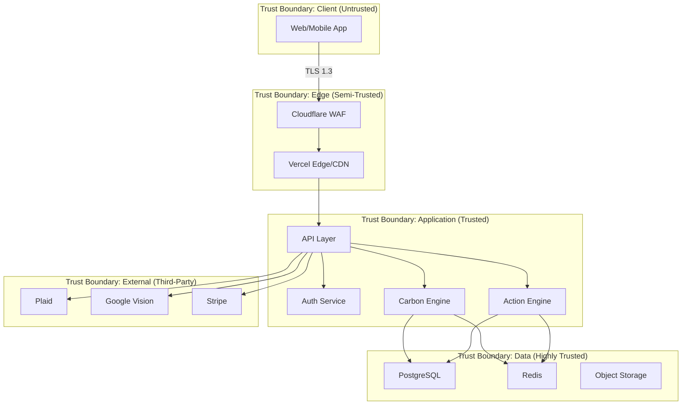
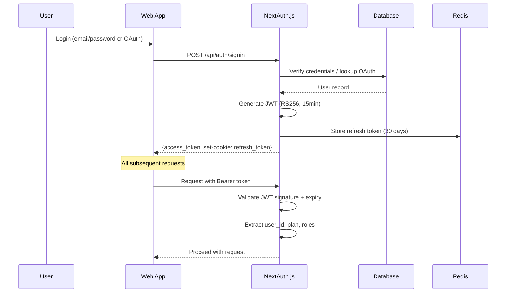
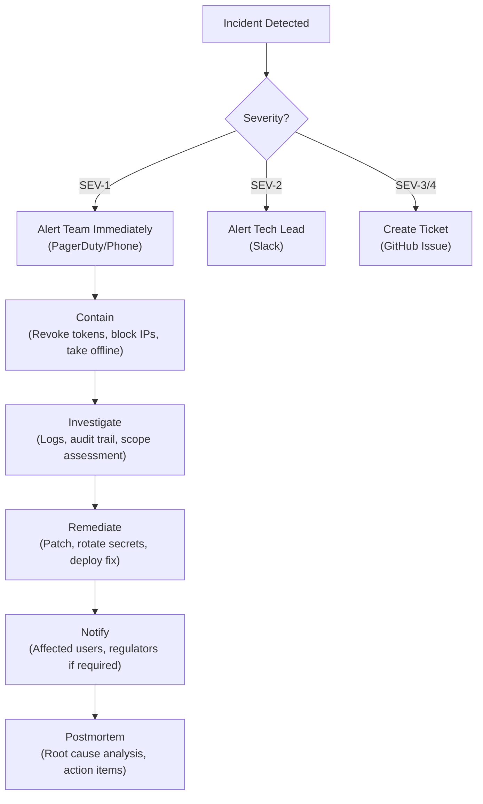

# Security Design Document

**Project:** Footprint Lens
**Version:** 1.0
**Date:** June 2026
**Status:** Draft

---

## 1. Security Overview

Footprint Lens processes **financially sensitive data** (bank transactions via Plaid), **personally identifiable information** (email, location, lifestyle profiles), and **behavioral data** (carbon footprint history, actions completed). Security is a foundational requirement, not an afterthought.

### 1.1 Security Principles

1. **Least Privilege** — Every component has minimum access required
2. **Defense in Depth** — Multiple overlapping security controls
3. **Zero Trust** — Verify every request regardless of origin
4. **Privacy by Design** — Collect only what's needed; anonymize by default
5. **Shift Left** — Security integrated into development, not bolted on after

---

## 2. Threat Model

### 2.1 System Boundaries



### 2.2 Threat Actors

| Actor | Motivation | Capability | Targets |
|:---|:---|:---|:---|
| **Script Kiddies** | Vandalism, credential stuffing | Low – Automated tools | Login endpoints, public APIs |
| **Hackers** | Data theft, financial gain | Medium – Custom exploits | User PII, bank connection tokens |
| **Competitors** | Business intelligence | Medium – Social engineering | Aggregate data, user metrics |
| **Insiders** | Negligence, disgruntlement | High – System access | Database, secrets, code |
| **Nation-State** | Surveillance | Very High | User location data, behavioral profiles |

### 2.3 STRIDE Analysis

| Threat | Category | Asset | Mitigation |
|:---|:---|:---|:---|
| Attacker impersonates user | **S**poofing | User sessions | MFA (future), JWT validation, OAuth only |
| Carbon data modified in transit | **T**ampering | API requests | TLS 1.3, request signing, input validation |
| Insider denies malicious action | **R**epudiation | Audit trail | Structured audit logging with tamper detection |
| Bank data exposed via breach | **I**nformation Disclosure | PII, financial data | Encryption at rest (AES-256), Plaid tokenization |
| Service disrupted by DDoS | **D**enial of Service | API availability | Cloudflare WAF, rate limiting, auto-scaling |
| User accesses another user's data | **E**levation of Privilege | User data | RLS, JWT scope validation, authorization middleware |

---

## 3. Authentication & Authorization

### 3.1 Authentication Architecture



### 3.2 Authentication Controls

| Control | Implementation |
|:---|:---|
| Password hashing | bcrypt with cost factor 12 |
| Token signing | RS256 (asymmetric) with key rotation every 90 days |
| Access token lifetime | 15 minutes |
| Refresh token lifetime | 30 days (stored in HttpOnly Secure SameSite cookie) |
| Token storage (client) | Access token in memory only; never localStorage |
| Session invalidation | Refresh token revocation on logout; token blacklist in Redis |
| OAuth providers | Google, Apple (via Auth.js) |
| Anonymous sessions | Short-lived JWT (24 hours); upgrade path to full account |
| Brute force protection | Account lockout after 5 failed attempts (30-minute cooldown) |

### 3.3 Authorization Model

```
Role-Based Access Control (RBAC) + Resource-Level Policies

Roles:
  - anonymous: Limited to onboarding, profile view
  - free_user: Full app access minus premium features
  - premium_user: All features including AR, Tier 3, advanced analytics
  - admin: Internal dashboard, impact report management

Resource Policies:
  - Users can only access their own data (enforced via RLS + middleware)
  - Cohort data is anonymized (no individual member data visible)
  - Impact reports are public (read-only)
```

### 3.4 API Authorization Middleware

```typescript
// Middleware chain for every protected route
// 1. Rate limit check
// 2. JWT validation
// 3. User existence check
// 4. Subscription tier check (for premium endpoints)
// 5. Resource ownership check (user_id match)
```

---

## 4. Data Protection

### 4.1 Encryption

| Layer | Standard | Implementation |
|:---|:---|:---|
| Data in Transit | TLS 1.3 | Enforced by Vercel + Cloudflare; HSTS header |
| Data at Rest (DB) | AES-256 | Neon PostgreSQL encryption at rest (managed) |
| Data at Rest (Storage) | AES-256 | Cloudflare R2 server-side encryption |
| Data at Rest (Redis) | AES-256 | Upstash encryption at rest (managed) |
| Sensitive Fields | Application-level encryption | Email, bank tokens encrypted with app key before DB storage |
| API Keys/Secrets | Vault/Env encryption | Vercel encrypted environment variables |

### 4.2 PII Handling

| Data Type | Classification | Storage | Access Control | Retention |
|:---|:---|:---|:---|:---|
| Email | PII | Encrypted in `users` table | User + admin only | Until deletion + 30 days |
| Password hash | Secret | bcrypt hash in `users` table | Auth system only | Until deletion |
| Bank connection tokens | Highly Sensitive | Plaid token vault (never our DB) | Plaid API only | Until disconnected |
| Transaction amounts | Sensitive | `transactions` table | User only (RLS) | 5 years |
| Location data | PII | Not stored persistently | Session-only; used for grid lookup | Not retained |
| Carbon footprint | Personal | `carbon_records` table | User only (RLS) | 5 years |
| Cohort activity | Semi-public | Anonymized in `quest_progress` | Cohort members | 1 year |

### 4.3 Data Anonymization

- **Cohort feeds:** All activity entries stripped of `user_id` before serving
- **Percentile rankings:** Computed on aggregated, anonymized data; never reveal individual records
- **Analytics warehouse:** PII stripped before export to analytics
- **Impact reports:** Only aggregate numbers published

### 4.4 GDPR / CCPA Compliance

| Right | Implementation |
|:---|:---|
| Right to Access | `GET /v1/profile/export` — full JSON/CSV export |
| Right to Erasure | `DELETE /v1/profile` — 30-day soft delete, then hard purge |
| Right to Rectification | `PATCH /v1/profile` — users can update all profile data |
| Right to Portability | Export endpoint provides machine-readable format |
| Right to Object | Users can disable specific data processing (e.g., location tracking) |
| Data Minimization | Only collect data necessary for carbon calculation |
| Privacy by Default | Anonymous sessions; no data shared without explicit consent |
| Consent Management | Granular consent toggles in Privacy Center |

---

## 5. OWASP Top 10 Mitigations

### A01: Broken Access Control

| Risk | Mitigation |
|:---|:---|
| Horizontal privilege escalation | PostgreSQL Row-Level Security (RLS) on all user-scoped tables |
| Missing function-level access control | Authorization middleware on every route; role checks |
| Insecure direct object references | UUIDs (not sequential IDs); ownership validation in queries |
| CORS misconfiguration | Restrict to `footprintlens.app` and known subdomains only |

### A02: Cryptographic Failures

| Risk | Mitigation |
|:---|:---|
| Weak password hashing | bcrypt with cost factor 12 (adaptive; will increase over time) |
| Insecure token signing | RS256 (asymmetric) with regular key rotation |
| Sensitive data in URLs | Never pass tokens, PII, or sensitive data in query parameters |
| Missing TLS | HSTS header enforced; automatic HTTPS redirect |

### A03: Injection

| Risk | Mitigation |
|:---|:---|
| SQL Injection | Drizzle ORM parameterized queries (no raw SQL interpolation) |
| NoSQL Injection | N/A (PostgreSQL only) |
| XSS | React's default JSX escaping; Content-Security-Policy header |
| Command Injection | No `exec()` or shell commands from user input |

### A04: Insecure Design

| Risk | Mitigation |
|:---|:---|
| Missing rate limiting | Per-user + per-IP rate limits on all endpoints |
| Business logic abuse | Action completion cooldowns; receipt scan rate limits |
| Missing input validation | Zod schemas for all API inputs (both client and server) |

### A05: Security Misconfiguration

| Risk | Mitigation |
|:---|:---|
| Default credentials | No default accounts; all secrets generated and stored securely |
| Unnecessary features | Production builds strip dev tools, source maps, debug logging |
| Missing security headers | All headers enforced via middleware (see Section 6) |
| Open cloud storage | R2 buckets private by default; signed URLs for user access |

### A06: Vulnerable Components

| Risk | Mitigation |
|:---|:---|
| Known vulnerabilities in dependencies | `npm audit` in CI; Snyk monitoring; Dependabot PRs |
| Outdated packages | Weekly automated dependency update PRs |
| Supply chain attacks | Lock file integrity checks; verify package provenance |

### A07: Authentication Failures

| Risk | Mitigation |
|:---|:---|
| Credential stuffing | Rate limiting + account lockout (5 attempts / 30 min) |
| Weak passwords | Minimum 8 characters, complexity validation |
| Session fixation | New session ID on authentication state change |
| Token leakage | HttpOnly, Secure, SameSite cookies; no localStorage |

### A08: Software & Data Integrity

| Risk | Mitigation |
|:---|:---|
| Unsigned deployments | Vercel-managed deployment pipeline; GitHub-enforced PR reviews |
| CI/CD poisoning | Branch protection rules; required reviews; signed commits (future) |
| Webhook spoofing | Plaid webhook signature verification; Stripe signature verification |

### A09: Logging & Monitoring Failures

| Risk | Mitigation |
|:---|:---|
| Missing audit trail | All auth events logged (login, logout, token refresh, failure) |
| Insufficient monitoring | Sentry for errors; Vercel Analytics for performance; custom business metrics |
| Log injection | Structured JSON logging; no user input in log format strings |

### A10: Server-Side Request Forgery (SSRF)

| Risk | Mitigation |
|:---|:---|
| SSRF via URL inputs | No user-controlled URLs fetched server-side |
| Internal service exposure | All internal services behind Vercel serverless boundary (no exposed ports) |

---

## 6. Security Headers

```typescript
// next.config.js security headers
const securityHeaders = [
  {
    key: 'Strict-Transport-Security',
    value: 'max-age=63072000; includeSubDomains; preload'
  },
  {
    key: 'Content-Security-Policy',
    value: "default-src 'self'; script-src 'self' 'unsafe-inline' 'unsafe-eval' https://js.stripe.com; style-src 'self' 'unsafe-inline' https://fonts.googleapis.com; font-src 'self' https://fonts.gstatic.com; img-src 'self' data: https://*.footprintlens.app https://cdn.footprintlens.app; connect-src 'self' https://api.footprintlens.app https://*.plaid.com https://*.stripe.com https://*.sentry.io https://*.posthog.com; frame-src https://js.stripe.com;"
  },
  {
    key: 'X-Content-Type-Options',
    value: 'nosniff'
  },
  {
    key: 'X-Frame-Options',
    value: 'DENY'
  },
  {
    key: 'X-XSS-Protection',
    value: '1; mode=block'
  },
  {
    key: 'Referrer-Policy',
    value: 'strict-origin-when-cross-origin'
  },
  {
    key: 'Permissions-Policy',
    value: 'camera=(self), geolocation=(self), microphone=()'
  }
];
```

---

## 7. Security Checklist

### Pre-Launch Checklist

- [ ] **Authentication**
  - [ ] JWT validation on every protected endpoint
  - [ ] Refresh token rotation implemented
  - [ ] Brute force protection (account lockout)
  - [ ] OAuth callback URLs whitelisted
  - [ ] Session invalidation on password change

- [ ] **Authorization**
  - [ ] RLS enabled on all user-scoped tables
  - [ ] Authorization middleware on all API routes
  - [ ] Premium feature gating verified
  - [ ] Admin endpoints protected with separate auth

- [ ] **Data Protection**
  - [ ] TLS 1.3 enforced (verify via SSL Labs A+ rating)
  - [ ] HSTS header configured
  - [ ] Sensitive fields encrypted at application level
  - [ ] No PII in logs, URLs, or error messages
  - [ ] GDPR data export and deletion endpoints working

- [ ] **Input Validation**
  - [ ] Zod schemas on all API inputs
  - [ ] File upload validation (type, size, content)
  - [ ] SQL injection tests passed
  - [ ] XSS tests passed

- [ ] **Infrastructure**
  - [ ] All secrets in environment variables (not code)
  - [ ] Production debug mode disabled
  - [ ] Source maps disabled in production
  - [ ] CORS restricted to known origins
  - [ ] Rate limiting operational
  - [ ] WAF rules configured

- [ ] **Dependencies**
  - [ ] `npm audit` clean (no high/critical vulnerabilities)
  - [ ] Snyk monitoring enabled
  - [ ] Lock file committed and verified

- [ ] **Monitoring**
  - [ ] Auth event logging operational
  - [ ] Error tracking (Sentry) configured
  - [ ] Security alerts configured (rate limit violations, auth failures)
  - [ ] Webhook signature verification implemented (Plaid, Stripe)

- [ ] **Compliance**
  - [ ] Privacy policy published
  - [ ] Cookie consent implemented
  - [ ] Data processing agreement with Plaid/Stripe
  - [ ] GDPR data subject request flow tested

---

## 8. Incident Response Plan

### 8.1 Severity Levels

| Level | Description | Example | Response Time |
|:---|:---|:---|:---|
| **SEV-1** | Critical — Active data breach or service compromise | Unauthorized data access, credential leak | Immediate (< 15 min) |
| **SEV-2** | High — Security vulnerability discovered | XSS, broken access control | < 1 hour |
| **SEV-3** | Medium — Security improvement needed | Missing security header, weak configuration | < 24 hours |
| **SEV-4** | Low — Best practice improvement | Dependency update, documentation gap | Next sprint |

### 8.2 Response Workflow



---

## 9. Third-Party Security Assessment

| Third Party | Data Access | Compliance | Risk Level |
|:---|:---|:---|:---|
| **Plaid** | Bank transaction data | SOC 2 Type II, ISO 27001 | Low (industry standard) |
| **Stripe** | Payment card data | PCI DSS Level 1 | Low (handles all card data) |
| **Neon** | All database data | SOC 2 Type II | Low (encrypted at rest) |
| **Vercel** | Application code, env vars | SOC 2 Type II | Low (encrypted secrets) |
| **Google Vision** | Receipt images (temporary) | SOC 2, ISO 27001 | Medium (PII in receipts) |
| **Cloudflare** | Traffic metadata | SOC 2 Type II | Low (proxy only) |
| **Upstash** | Cache data, sessions | SOC 2 Type II | Low (ephemeral data) |
| **PostHog** | Analytics events | GDPR compliant | Low (no PII sent) |

---

*Document maintained by the Security Team. Last updated: June 2026.*
