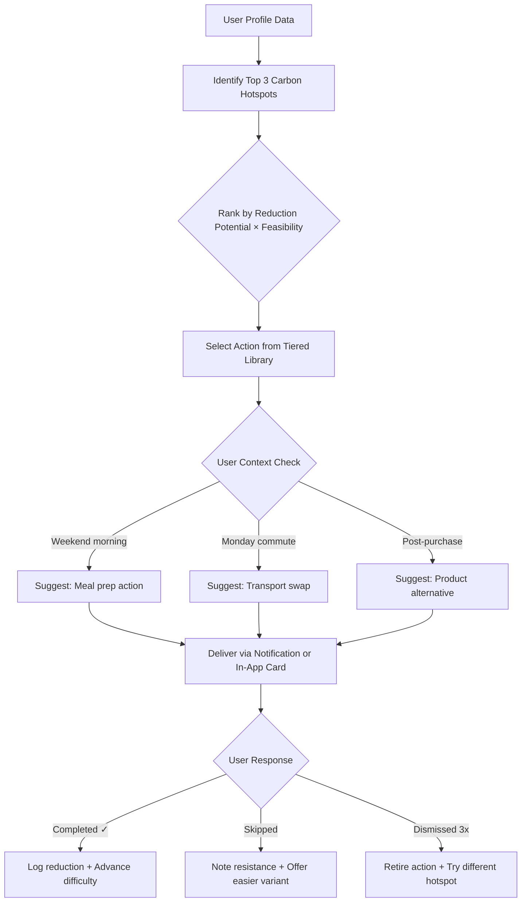
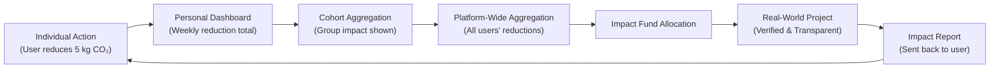
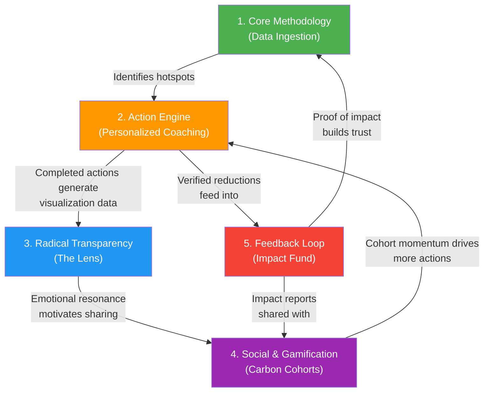

# **Footprint Lens** — See Your Impact. Shrink It. Prove It.

> *"What if the most powerful climate action on Earth started with your morning coffee?"*

---

## Product Pitch

**Footprint Lens** is a personal carbon intelligence platform that turns your existing financial and household data into a living, breathing map of your environmental impact — then coaches you, step by step, toward a lighter life. It doesn't lecture. It doesn't shame. It *reveals*, *rewards*, and *reinvests*.

### The "Aha Moment"

> The aha moment isn't your carbon score.
>
> It's Day 3. You tap "Scan Receipt" at the grocery store. In 1.2 seconds, Footprint Lens highlights that your usual brand of almond milk ships from 1,400 miles away and suggests a local oat milk — same price, 68% lower transport emissions. It shows a tiny animation: a balloon of CO₂ the size of a beach ball deflating to the size of a tennis ball. You think: *"Huh, that was easy."*
>
> Then it says: *"This swap, done weekly for a year, is the equivalent of keeping one mature oak tree standing. You just planted your first tree."*
>
> That's when you're hooked. Not by guilt. By *clarity*.

---

## 1. The Core Methodology — "Passive Precision"

### Design Philosophy: Accuracy Through Laziness

The fundamental insight is that **the best data is data the user already generates**. Every purchase, every utility bill, every commute is already a data point. Our job is to *listen*, not to *interrogate*.

### The Three-Tier Data Ingestion Strategy

```
┌─────────────────────────────────────────────────────────────┐
│                    TIER 1: AUTOMATIC                         │
│  (Zero effort — connected once, runs forever)                │
│                                                              │
│  • Open Banking API (Plaid/TrueLayer/Yodlee)                │
│    → Categorizes every transaction into carbon buckets:      │
│      groceries, fuel, flights, dining, fashion, etc.         │
│    → Uses merchant-level data (Shell vs. EV charging,        │
│      McDonald's vs. local vegan café)                        │
│                                                              │
│  • Utility Integration (UtilityAPI / Green Button Connect)   │
│    → Pulls electricity, gas, and water usage monthly         │
│    → Cross-references with grid carbon intensity data        │
│      (electricityMap API) for location-aware emissions       │
│                                                              │
│  • Smart Device Sync (Nest, Ecobee, smart plugs)             │
│    → Real-time energy consumption at the appliance level     │
│                                                              │
├─────────────────────────────────────────────────────────────┤
│                    TIER 2: LOW-FRICTION                       │
│  (Occasional, <10 seconds per interaction)                   │
│                                                              │
│  • Receipt Scanner (OCR via Google Vision / AWS Textract)    │
│    → Snap a grocery receipt → item-level carbon tagging      │
│    → Uses a product lifecycle database (e.g., Open Food      │
│      Facts + Climatiq API) for per-SKU emission factors      │
│                                                              │
│  • Travel Detection (with permission)                        │
│    → Background location + motion API detects car/bus/       │
│      bike/walk → auto-logs commute mode                      │
│    → Flight detection via calendar event parsing or          │
│      email receipt scanning (Gmail/Outlook API)              │
│                                                              │
├─────────────────────────────────────────────────────────────┤
│                    TIER 3: ONBOARDING ONLY                   │
│  (Once, ~90 seconds, never again)                            │
│                                                              │
│  • "5-Tap Profile" — NOT a questionnaire                     │
│    → Visual card-swipe UI (like Tinder for lifestyle):       │
│      🏠 Home type: Apartment / House / Shared                │
│      🚗 Primary transport: Car / Transit / Bike / Mix        │
│      🥩 Diet: Omnivore / Flexitarian / Vegetarian / Vegan    │
│      ✈️ Flights/year: 0 / 1-3 / 4-8 / 9+                   │
│      🛒 Shopping habit: Minimal / Average / Frequent         │
│                                                              │
│    → This seeds the model. Tier 1 & 2 data overwrites        │
│      and refines these estimates within 2 weeks.             │
│                                                              │
└─────────────────────────────────────────────────────────────┘
```

### The Accuracy / Effort Tradeoff: "Progressive Fidelity"

| Data Source | Accuracy | User Effort | Coverage |
|:---|:---|:---|:---|
| 5-Tap Profile alone | ~55% | 90 seconds (once) | Broad estimates |
| + Bank API connected | ~78% | 2 min setup (once) | Spending-based categories |
| + Receipt scanning (weekly) | ~85% | 10 sec/scan | Item-level groceries |
| + Utility + Smart Home | ~92% | 5 min setup (once) | Home energy granularity |
| + Travel detection | ~95% | Permission grant (once) | Transport precision |

> [!TIP]
> **Behavioral Science Principle — Endowed Progress Effect**: On sign-up, we show the accuracy meter at 55% and say *"You're already halfway to a precise footprint. Connect your bank to jump to 78%."* Research shows people are more likely to complete a goal if they feel they've already started (Nunes & Drèze, 2006).

### Carbon Calculation Engine

The backend uses **emission factor databases** from:
- **DEFRA** (UK Gov) — activity-based emission factors
- **EPA eGRID** — US regional electricity carbon intensity
- **Climatiq API** — programmatic access to 10,000+ emission factors
- **Open Food Facts** — per-product lifecycle analysis

Every transaction is mapped: `Merchant → Category → Emission Factor × Amount = kg CO₂e`. Machine learning refines category mapping over time using a feedback loop where users can correct miscategorizations (e.g., "This Uber charge was for Uber Eats, not a ride").

---

## 2. The "Action Engine" — Your Personal Climate Coach

### Design Philosophy: Coach, Not Textbook

The Action Engine doesn't show a list. It shows **one action at a time**, precisely chosen for *this* user at *this* moment, using a recommendation system inspired by how Duolingo sequences language lessons.

### The Matching Logic: Profile → Action Pipeline



### The Three Tiers of Action Difficulty

Each action in the library is tagged with a **tier**, a **carbon reduction estimate**, and a **feasibility score** based on the user's profile:

#### 🟢 Tier 1: "Light Switches" (Week 1–4)
*Near-zero effort. Immediate. Often saves money.*

| If Profile Shows… | Action Delivered |
|:---|:---|
| High grocery spend, meat-heavy | *"Try swapping beef for chicken in tonight's dinner. Same protein, 6x less carbon. Here's a 15-min recipe."* |
| Daily car commute <5 miles | *"Tomorrow, try one leg by bus. Your route has a direct line (Route 42, 7:15 AM). Save $3.20 in gas."* |
| High electricity bill, no smart thermostat | *"Lower your thermostat 2°F tonight. You won't feel it. Your furnace will burn 8% less gas."* |
| Frequent Amazon purchases | *"Next order, select 'No-Rush Shipping.' Amazon consolidates shipments — 30% fewer delivery truck trips."* |

#### 🟡 Tier 2: "Habit Builders" (Month 2–6)
*Requires repeated commitment. Builds identity ("I'm the kind of person who…").*

| If Profile Shows… | Action Delivered |
|:---|:---|
| Consistent grocery receipt data | *"You've scanned 8 receipts. Your top 3 carbon items are beef mince, imported cheese, and bottled water. This week's challenge: replace ONE of these three."* |
| Daily commute data shows car only | *"You've driven 340 miles this month for commuting. Bike Wednesdays? Over a year, that's 1,200 fewer miles — equal to removing 0.5 tons of CO₂."* |
| Utility data: high standby power draw | *"Your 'phantom load' from devices on standby costs you ~$90/year and emits 200 kg CO₂. Here's a $15 smart power strip that kills it."* |

#### 🔴 Tier 3: "Lifestyle Levers" (Month 6+)
*High-impact decisions. Presented only after trust is established and the user has seen the data.*

| If Profile Shows… | Action Delivered |
|:---|:---|
| 5+ flights/year | *"Your flights are 38% of your total footprint. For your next domestic trip, here's an Amtrak route that's 12x lower carbon and only 2 hours longer. Book here."* |
| High gas usage, owns home | *"You've saved 1.2 tons this year through behavior changes. Your next big lever: a heat pump. Here's a local installer with financing. Estimated payback: 4 years."* |
| Lease renewal approaching | *"Your current commute generates 2.1 tons/year. Here are 3 apartments closer to work within your budget that would cut that by 60%."* |

> [!IMPORTANT]
> **Behavioral Science Principle — Commitment & Consistency (Cialdini)**: By getting users to complete small Tier 1 actions first, they begin to self-identify as "someone who cares about their footprint." By the time Tier 3 suggestions arrive, the user's self-image has shifted, making big decisions psychologically congruent rather than jarring.

### The "Unlock" Mechanic

Tier 2 actions are visually locked with a frosted-glass overlay: *"Complete 5 Light Switch actions to unlock Habit Builders."* This provides:
- **Curiosity gap** (what's behind the glass?)
- **Earned progression** (the user feels they've leveled up)
- **Skill building** (they've proven they can sustain small changes before facing bigger ones)

---

## 3. Radical Transparency — "The Lens"

### Design Philosophy: Make CO₂ as Tangible as Rain

This is the feature that gives the product its name. **Footprint Lens** is, at its core, a *translator* — converting an abstract gas measured in tons into visceral, emotionally resonant physical metaphors.

### The Equivalence Engine

Every carbon value in the app is accompanied by a **"Lens View"** toggle. Tap it, and the number transforms:

#### Static Equivalences (Always Available)

| Your Footprint | "Through the Lens" |
|:---|:---|
| 12 tons CO₂/year (US average) | 🎈 *"Enough CO₂ to fill 6.8 million party balloons — imagine them filling your house, floor to ceiling, 680 times over."* |
| 1 ton CO₂ | 🧊 *"Melts 32 square feet of Arctic sea ice — roughly the size of your bathroom floor. Gone. Every year."* |
| 100 kg CO₂ (a round-trip domestic flight) | 🌳 *"5 mature trees would need to work full-time for an entire year to clean this up."* |
| 5 kg CO₂ (a single beef steak) | 🚿 *"The same carbon as leaving your shower running hot for 3 hours straight."* |

#### Dynamic "AR Lens" Feature (Flagship Differentiator)

Using the phone's camera and ARKit/ARCore:

1. **Living Room Fill**: Point your camera at your room. The app renders translucent CO₂ balloons filling the space in real-time, showing your *monthly* emissions as a volume of gas. Swipe left to see last month. Swipe right to see your projected month if you complete this week's actions. Watch the balloons shrink.

2. **Glacier View**: A persistent AR widget shows a mini glacier on your home screen. It's sized proportionally to your remaining annual "carbon budget" (based on the 1.5°C target). Every emission event chips a visible chunk off. Every completed action rebuilds a sliver. It's slow, visible, and *personal*.

3. **Receipt Lens**: After scanning a grocery receipt, each item gets a small colored aura in the receipt view:
   - 🟢 Green: Low carbon item
   - 🟡 Amber: Moderate
   - 🔴 Red: High impact
   - Tapping a red item shows: *"This 500g beef mince = 13 kg CO₂. That's the equivalent of driving 33 miles. Swap to lentils and this drops to 0.9 kg — a 93% reduction."*

> [!NOTE]
> **Behavioral Science Principle — Construal Level Theory**: Abstract, distant threats (climate change in 2100) don't motivate behavior. By making CO₂ *spatial* (filling your room), *temporal* (a glacier shrinking in real-time), and *personal* (your bathroom floor of ice), we collapse psychological distance and trigger action.

### The "Time Machine" Visualization

A full-screen, swipeable timeline:

```
Past You ◄━━━━━━━━━━━━━━━━━━━━━━━━━► Future You

Jan 2026          TODAY            Dec 2026
14.2 tons/yr      11.8 tons/yr     → 8.3 tons/yr (projected)
                                     if you maintain current pace

🏠 880 balloons    🏠 740 balloons   🏠 520 balloons
   /month             /month            /month
```

The user can *feel* the trajectory. The projected future is not a threat — it's an invitation.

---

## 4. Social & Gamification Framework — "Carbon Cohorts"

### Design Philosophy: Together is Better. Competition is Poison.

Every gamification decision in Footprint Lens follows one rule: **You only compete against your past self. You only collaborate with others.**

### Carbon Cohorts: How They Work

A **Carbon Cohort** is a small group (4–12 people) who share a reduction goal. They can be:

- **Friends & Family** (invited via link)
- **Neighbors** (auto-suggested by zip code: *"8 people on your street are on Footprint Lens"*)
- **Workplace Teams** (integrated via corporate wellness programs)
- **Interest-Based** (e.g., "Parents reducing kids' lunchbox footprint," "Frequent Flyers Anonymous")

### What a "Win" Looks Like

#### Individual Wins: Personal Bests, Not Rankings

```
┌──────────────────────────────────────────────────┐
│  🏅 PERSONAL MILESTONE                           │
│                                                   │
│  Your October footprint: 0.82 tons               │
│  Your October last year: 1.14 tons               │
│                                                   │
│  ↓ 28% reduction year-over-year                  │
│                                                   │
│  "You're now in the top 20% of users in your     │
│   region — without knowing who they are."         │
│                                                   │
│  🌳 Equivalent: 4 extra trees planted this month  │
└──────────────────────────────────────────────────┘
```

> [!TIP]
> **Key Design Decision**: We show *percentile rank* (top 20%) but never a *leaderboard*. You know roughly where you stand, but you can't compare against named individuals. This preserves **social proof** (I'm doing better than most!) without enabling **social comparison** (Dave is better than me, I suck).

#### Cohort Wins: Collective Challenges

Each Cohort selects (or is auto-assigned) a **Community Quest**:

| Quest Type | Example | Mechanic |
|:---|:---|:---|
| **Conservation Anchor** | *"Keep Our Park Breathing"* — Your cohort's collective reduction goal is pegged to the annual carbon sequestration of a local park or forest. | A visual map shows the park. As the cohort reduces, the trees glow greener. Hit the goal = the park is "fully sustained" by your cohort. |
| **Offset Race** | *"Zero-Out February"* — Can your cohort collectively offset an entire month's emissions through behavioral changes alone (no purchased offsets)? | A shared progress bar fills. Each member's contribution is shown as an anonymous colored block. No names, no shaming. |
| **Swap Sprint** | *"50 Swaps in 7 Days"* — The cohort collectively completes 50 product/behavior swaps from the Action Engine. | A shared "swap wall" shows each swap as a card (anonymized): *"Someone swapped to oat milk — 2.1 kg saved!"* Feels like a live feed of momentum. |

### The "Ripple" Notification

When a cohort member completes an action, others get a gentle, anonymized nudge:

> *"A member of your cohort just made a transport swap. Your group is 73% to this week's goal."* 🌊

This uses **social proof** without surveillance. No one knows *who* did it. Everyone knows *something is happening*.

### Anti-Shame Safeguards

- **No red metrics for others to see.** Your data is yours alone.
- **"Pause" mode.** Life gets hard. Users can pause their participation for up to 30 days without losing streaks or rank. The app says: *"Taking care of yourself is sustainable too. We'll be here."*
- **No public failure states.** If a cohort misses a goal, the message is: *"You covered 68% of the park this month. That's 68% more than doing nothing. New goal for next month?"*

---

## 5. The "So What?" Feedback Loop — "The Ripple Effect"

### Design Philosophy: Close the Loop or Lose the User

This is where Footprint Lens transcends a tracking app and becomes a **movement engine**. Every gram of CO₂ reduced is logged, aggregated, anonymized, and *channeled into provable real-world impact*.

### Architecture of the Feedback Loop



### How It Works: The Impact Fund

1. **Revenue Model Integration**: Footprint Lens operates on a freemium model. Premium subscribers ($4.99/month) unlock advanced analytics, AR features, and Tier 3 action coaching. **10% of all subscription revenue** flows into the **Footprint Lens Impact Fund**.

2. **Behavioral Reduction Matching**: For every **verified ton of CO₂** reduced by the user base (measured via connected data sources), the Impact Fund **matches it with a funded conservation action**. Partners include:
   - **Gold Standard** — verified carbon offset projects
   - **Pachama** — AI-verified forest protection (satellite-monitored)
   - **Climeworks** — direct air capture credits

3. **The "Your Slice" Feature**: Each user sees *their* proportional contribution to the collective:

```
┌──────────────────────────────────────────────────────┐
│  🌍 YOUR RIPPLE EFFECT — June 2026                    │
│                                                       │
│  You reduced:              48 kg CO₂ this month      │
│  Your Cohort reduced:      312 kg CO₂                │
│  All Footprint Lens users: 847 tons CO₂              │
│                                                       │
│  ──────────────────────────────────────────────       │
│                                                       │
│  Because of our collective action this month:         │
│                                                       │
│  🌳 12 acres of Amazon rainforest are now             │
│     under funded protection via Pachama               │
│     (Satellite verification link →)                   │
│                                                       │
│  🏭 2.4 tons of CO₂ were permanently removed          │
│     from the atmosphere via Climeworks                │
│     (Removal certificate #FL-2026-0847 →)            │
│                                                       │
│  Your personal contribution to this:                  │
│  ≈ 6.2 square feet of rainforest canopy 🌿           │
│                                                       │
│  ──────────────────────────────────────────────       │
│                                                       │
│  📸 See the forest → [Live satellite image]           │
│  📜 Verification → [Gold Standard Certificate]        │
│                                                       │
└──────────────────────────────────────────────────────┘
```

### The "Living Forest" — Persistent Impact Visualization

Each user has a persistent "Living Forest" in their profile — a procedurally generated digital forest that grows based on their cumulative lifetime reductions:

- **Each tree** represents 100 kg of CO₂ reduced
- **Tree species** vary by the *type* of reduction (transport = birch, diet = oak, energy = pine)
- **Wildlife** appears at milestones (a fox at 1 ton, a deer at 5 tons, an eagle at 10 tons)
- **The forest is shareable** — a single screenshot that tells your whole story without revealing any private data

> [!IMPORTANT]
> **Behavioral Science Principle — "Tangible Progress" & Loss Aversion**: The forest *cannot shrink* — it represents cumulative impact. But trees can go from vibrant green to faded grey during inactive months, creating a gentle **loss aversion** cue (*"Your forest is fading…"*) without ever punishing the user by removing progress.

### Transparency Guarantees

- All funded projects are **third-party verified** (Gold Standard, Verra VCS, or Puro.earth)
- Monthly **impact reports** are published publicly on footprintlens.org/impact
- A **blockchain-anchored ledger** (lightweight, not crypto-hype) timestamps every fund allocation for auditability
- Users can vote quarterly on which project categories receive funding (reforestation vs. ocean cleanup vs. direct air capture)

---

## System Integration Map

All five components form a closed loop:



**The virtuous cycle**: Data fuels coaching → Coaching produces actions → Actions produce visceral visualizations → Visualizations spark social sharing → Social momentum drives more actions → More actions fund real-world projects → Proof of real-world impact deepens user trust → Deeper trust leads to more data sharing → More data improves coaching precision.

---

## Summary: Why Footprint Lens Wins

| Dimension | The Standard Approach | Footprint Lens |
|:---|:---|:---|
| **Data Collection** | 30-question survey, entered once, stale forever | Passive financial + utility + smart home data, always fresh |
| **Actions** | Generic listicle: "recycle more" | AI-coached, context-aware, difficulty-progressive, personalized to your actual spending and lifestyle |
| **Visualization** | "You emit 12 tons/year" (meaningless) | AR balloons filling your living room. A glacier on your home screen, melting in real-time. Your bathroom floor in Arctic ice. |
| **Social** | Leaderboard ranking friends (shame spiral) | Anonymous cohorts, collective quests, no visible failure states, "pause" for life happens |
| **Impact Proof** | "Your actions help the planet" (trust me, bro) | Satellite-verified forest protection certificates with your name, live project dashboards, blockchain-audited fund allocation |
| **Emotional Core** | Guilt | Clarity → Curiosity → Agency → Pride |

> *Footprint Lens doesn't ask you to save the planet. It shows you — in balloons, in ice, in trees, in satellite photos — that you already are.*

---

*Product Design v1.0 — June 2026*
